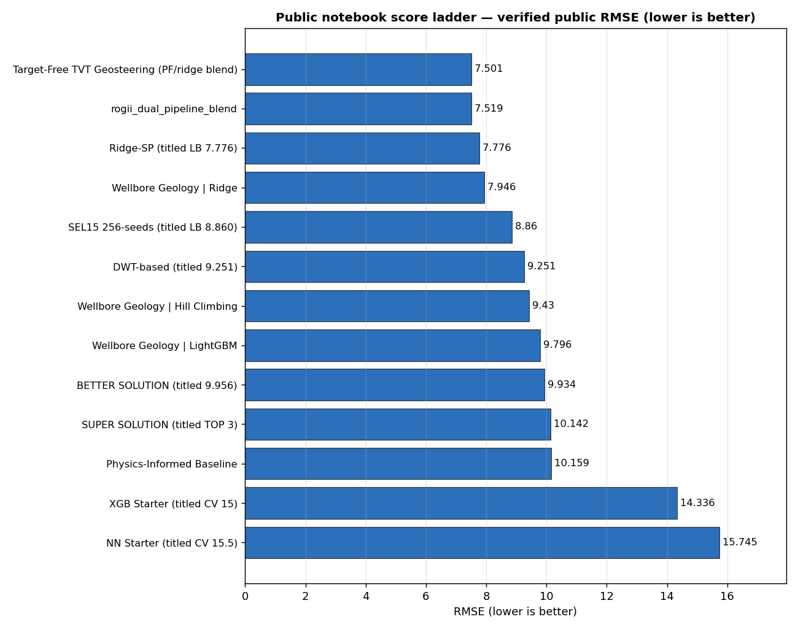
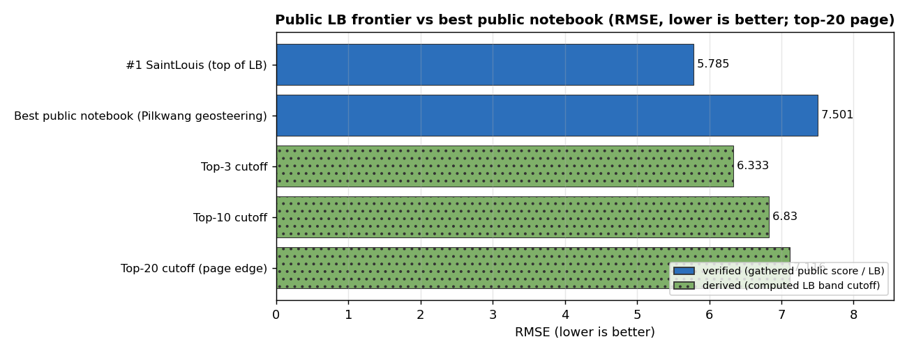
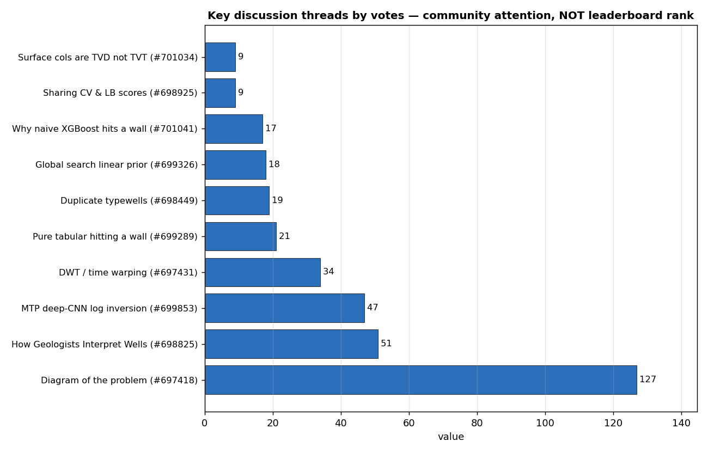

# ROGII Wellbore Geology Prediction — Strategy Brief

*Researched 2026-06-13 via the nvidia-kaggle skill (competition overview, dataset,
discussions, and public-kernel scores). All public scores in the ladder were fetched
individually this run and are tagged accordingly; the leaderboard reflects the top-20
public page captured this run.*

[Competition page](https://www.kaggle.com/competitions/rogii-wellbore-geology-prediction)

---

## 1. What the competition actually is

You predict **TVT** (True Vertical Thickness) — a *relative geological depth index*
that says how far, vertically, the drill bit sits from a reference surface that follows
the local geological structure — along the **evaluation zone** of ~200 horizontal wells.

- **Metric:** RMSE on `tvt`, one prediction per 1-ft row in the evaluation zone.
  (Note: the discussion/kernel API metadata mislabels the metric as "MSE/Mean Squared
  Error"; the official **Evaluation** tab and submission format specify **RMSE**.)
- **Submission:** Notebook-only. CPU **or** GPU ≤ 9 hours, **internet disabled**, output
  `submission.csv`. Freely available external data and pretrained models are allowed
  (this is why top public notebooks ship companion "artifacts"/model datasets).
- **Timeline:** Started May 5, 2026 · Entry/Team-merge **Jul 29, 2026** · **Final
  submission Aug 5, 2026**. Prizes: \$25k / \$13k / \$7k / \$5k.
- **Public LB is ~26% of the test set** and competitors report it is **noisy** — the same
  notebook can score differently on reruns ([#704663](https://www.kaggle.com/competitions/rogii-wellbore-geology-prediction/discussion/704663)),
  and there is active debate on how much to trust it
  ([#704273](https://www.kaggle.com/competitions/rogii-wellbore-geology-prediction/discussion/704273),
  [#701995](https://www.kaggle.com/competitions/rogii-wellbore-geology-prediction/discussion/701995)).

### The data (per well)
Each well is an 8-char hash with two key CSVs:

- **`{well}__horizontal_well.csv`** — the lateral: `MD, X, Y, Z (TVD), GR`, plus
  `TVT` (target, train only), and **`TVT_input`** — a copy of TVT that is **NaN over the
  evaluation zone** (so the known TVT before the eval zone is a feature you must exploit).
  Training files also carry six geological-surface columns `ANCC, ASTNU, ASTNL, EGFDU,
  EGFDL, BUDA`. **Gotcha:** those surfaces are stored as **negative TVD (Z), not TVT** —
  plotting them against TVT puts them wildly off-scale
  ([#701034](https://www.kaggle.com/competitions/rogii-wellbore-geology-prediction/discussion/701034)).
- **`{well}__typewell.csv`** — a vertical reference log: `TVT` (depth index), `GR`
  signature, and a categorical `Geology` label. The typewell is effectively the
  **ground-truth GR-vs-TVT curve** you align the lateral against
  ([#697418](https://www.kaggle.com/competitions/rogii-wellbore-geology-prediction/discussion/697418)).

**Two data quirks worth knowing early:**
- **Duplicate typewells:** several distinct horizontal wells share an identical typewell
  file, sometimes across wells that are far apart — usable as a grouping/leak signal but
  also a validation hazard ([#698449](https://www.kaggle.com/competitions/rogii-wellbore-geology-prediction/discussion/698449)).
- **PNG cross-sections don't always match the CSV data**
  ([#705210](https://www.kaggle.com/competitions/rogii-wellbore-geology-prediction/discussion/705210)) — trust the CSVs, treat the PNGs as rough visual aids.

---

## 2. The core insight: this is a signal-alignment problem, not a tabular-regression problem

The single most important strategic fact, repeated across the strongest contributors:
**plain tabular GBDTs plateau**. A naive XGBoost/CatBoost on point features stalls around
**CV/LB ~10–15**, and the community has explicitly documented *why*:

- **"Why naive XGBoost hits a wall here"** — a literature review arguing the task is GR
  log *inversion*, not pointwise regression
  ([#701041](https://www.kaggle.com/competitions/rogii-wellbore-geology-prediction/discussion/701041)).
- **"Why pure Tabular Models might be hitting a wall (Spatial & Sequential Context)"**
  ([#699289](https://www.kaggle.com/competitions/rogii-wellbore-geology-prediction/discussion/699289)).
- A strong competitor (Tom): *"Current GBDTs are definitely not a good solution for this
  challenge"* ([#699207](https://www.kaggle.com/competitions/rogii-wellbore-geology-prediction/discussion/699207)).

The winning framing is **geosteering / log correlation**: take the lateral's MD–GR strip
and **"stretch and fold" it to match the typewell's TVT–GR reference**, then read off TVT.
This is a classic stratigraphic-correlation / dynamic-time-warping problem, and crucially
it is an **inverse problem** — *lower GR misfit does not mean lower TVT error*, so you must
optimize against TVT, not GR
([hengck23, #697431](https://www.kaggle.com/competitions/rogii-wellbore-geology-prediction/discussion/697431),
[#699326](https://www.kaggle.com/competitions/rogii-wellbore-geology-prediction/discussion/699326)).

---

## 3. The score landscape (what you're shooting at)

*Takeaway: every public notebook here was individually score-checked this run — the best
publicly reproducible notebooks cluster at **~7.5 RMSE**, alignment/signal methods sit
**~7.5–9**, and pure tabular starters land **~14–16**, so the floor you must beat with a
public fork is roughly 7.5.*

*Takeaway: the public top-20 page runs **5.785 → 7.116**; the best public notebook
(~7.50) wouldn't crack the top 20, so **the gap to a medal zone is ~1.5–2 RMSE of private
edge** beyond what's openly shared. Top-3/10/20 bars are computed cutoffs (hatched), the
two solid bars are gathered scores.*

**Verified score ladder** (each public-notebook number fetched individually this run; LB
rows from the top-20 page; *title-claim* = number asserted in a kernel's title but here
**confirmed by a fetched public score** unless noted):

| Rung | RMSE | Source |
|---|---|---|
| LB #1 (SaintLouis) | **5.785** | [leaderboard](https://www.kaggle.com/competitions/rogii-wellbore-geology-prediction/leaderboard) |
| LB top-3 cutoff | **6.333** | leaderboard (derived) |
| LB top-20 cutoff (page edge) | **7.116** | leaderboard (derived) |
| Best public notebook — Target-Free TVT Geosteering | **7.501** | [pilkwang](https://www.kaggle.com/code/pilkwang/rogii-target-free-tvt-geosteering) |
| Dual-pipeline blend | **7.519** | [pixiux](https://www.kaggle.com/code/pixiux/rogii-dual-pipeline-blend) |
| Ridge-SP (title says 7.776) | **7.776** | [lightningv08](https://www.kaggle.com/code/lightningv08/lb-7-776-rogii-ridge-sp) |
| Ridge artifact pipeline | **7.946** | [ravaghi](https://www.kaggle.com/code/ravaghi/wellbore-geology-prediction-ridge) |
| SEL15 256-seeds (title says 8.860) | **8.860** | [needless090](https://www.kaggle.com/code/needless090/lb-8-860-rogii-sel15-256seeds) |
| DWT-based (title says 9.251) | **9.251** | [nihilisticneuralnet](https://www.kaggle.com/code/nihilisticneuralnet/9-251-rogii-wellbore-geology-prediction-dwt-based) |
| LightGBM baseline | **9.796** | [ravaghi](https://www.kaggle.com/code/ravaghi/wellbore-geology-prediction-lightgbm) |
| "BETTER SOLUTION" (title says 9.956) | **9.934** | [romantamrazov](https://www.kaggle.com/code/romantamrazov/rogii-better-solution-lb-9-956) |
| Physics-Informed baseline | **10.159** | [karnakbaevarthur](https://www.kaggle.com/code/karnakbaevarthur/physics-informed-baseline) |
| XGB Starter (title says CV 15) | **14.336** | [cdeotte](https://www.kaggle.com/code/cdeotte/xgb-starter-cv-15) |
| NN Starter (title says CV 15.5) | **15.745** | [cdeotte](https://www.kaggle.com/code/cdeotte/nn-starter-cv-15-5) |

> Note one honesty flag: `romantamrazov/rogii-better-solution-lb-9-956` is *titled* 9.956
> but its **current fetched public score is 9.934**; the companion "SUPER SOLUTION |LB:
> TOP 3" notebook actually scores **10.142** today — a reminder that **title-embedded
> scores drift** and should be read as claims, not live rank.

Anchor expectations from a clean baseline: the carry-forward **last-known-`TVT_input`
baseline scores ≈ 15.9 RMSE locally** ([cdeotte XGB starter](https://www.kaggle.com/code/cdeotte/xgb-starter-cv-15));
a basic 5-fold-by-well LightGBM with light FE reaches **~9.7 LB**
([Tucker Arrants, #699207](https://www.kaggle.com/competitions/rogii-wellbore-geology-prediction/discussion/699207));
a representative honest single model is **CV 10.985 / LB 10.525**
([Zacchaeus, #698925](https://www.kaggle.com/competitions/rogii-wellbore-geology-prediction/discussion/698925)).

---

## 4. Techniques that work, each tied to evidence

**A. Residual-on-baseline framing (do this first).** Predict the *residual* from the
last-known `TVT_input` carry-forward rather than raw TVT. Zero residual = the ~15.9 RMSE
flat baseline, so the model only has to learn corrections. Keep `TVT_input` slope-
continuation (all-segment and recent-window slopes vs MD and Z) as features.
→ [cdeotte/xgb-starter-cv-15](https://www.kaggle.com/code/cdeotte/xgb-starter-cv-15).

**B. Typewell GR alignment / dynamic warping (the real lever).** Align the lateral GR to
the typewell GR–TVT curve by warping. `query_gr = np.interp(h_TVT, tw_TVT, tw_GR)` is the
forward model; invert it. Use **dynamic programming** over a discretized TVT state space
(~400 candidates in a ±200 ft window) with a smoothness penalty
`Σ (GR_obs − GR_typewell[state])²/σ + μ·|stateᵢ − stateᵢ₋₁|` — structurally identical to
Hale's dynamic image warping.
→ [hengck23 DWT thread #697431](https://www.kaggle.com/competitions/rogii-wellbore-geology-prediction/discussion/697431),
[Matteo Niccoli DP writeup #702919](https://www.kaggle.com/competitions/rogii-wellbore-geology-prediction/discussion/702919),
[DWT-based notebook](https://www.kaggle.com/code/nihilisticneuralnet/9-251-rogii-wellbore-geology-prediction-dwt-based).

**C. Particle-filter / beam-search trackers with a learned prior.** Treat TVT as a path
the bit traces (it can't jump); initialize from a linear prior `TVT ≈ linear(MD, Z)` fit
on the known segment + `TVT_input`, then run a particle filter / beam search and **score
candidates by TVT error, not GR error** (inverse-problem rule). Ensembling several
stiffness/scale settings captures both broad trend and local dip.
→ [hengck23 global-search #699326](https://www.kaggle.com/competitions/rogii-wellbore-geology-prediction/discussion/699326),
the PF/beam selector inside [lightningv08 Ridge-SP](https://www.kaggle.com/code/lightningv08/lb-7-776-rogii-ridge-sp).

**D. Blend a physics/geosteering trajectory with a learned model (current public best).**
The top public notebooks are **dual-pipeline blends**: a ridge/PF "physical" trajectory,
optionally denoised by a robust low-degree polynomial fit in `U = TVT + Z − anchor` space,
late-blended with a pretrained LightGBM trajectory (published weights ≈ ridge 0.30 inside
the heuristic, then λ≈0.55 between projected-PF and LGBM). Plus exact-match recovery for
test wells whose typewell/prefix matches a train well.
→ [pilkwang Target-Free Geosteering (7.501)](https://www.kaggle.com/code/pilkwang/rogii-target-free-tvt-geosteering),
[pixiux dual-pipeline blend (7.519)](https://www.kaggle.com/code/pixiux/rogii-dual-pipeline-blend).

**E. Deep CNN multi-trajectory inversion (the frontier idea).** Feed a 2D GR heatmap to a
CNN regression head + a Mixture-Density-Network that emits *multiple* path hypotheses
(k-beam style), matching keypoints between vertical and horizontal GR. hengck23 cautions
the formulation isn't the bottleneck — **the GR data is genuinely noisy** and hard even
for humans on a windowed view.
→ [MTP deep-CNN thread #699853](https://www.kaggle.com/competitions/rogii-wellbore-geology-prediction/discussion/699853)
(references arXiv 2201.01871, "Direct Multi-Modal Inversion of Geophysical Logs").

**F. Reconstruct the 3D site.** Train and test wells sit in the **same geological site**,
so hengck23's "trick to winning" is to reconstruct the local 3D geology from *all* wells
(train + test) and steer each lateral within it — spatial context the per-well tabular
view throws away.
→ [#697431](https://www.kaggle.com/competitions/rogii-wellbore-geology-prediction/discussion/699853),
[#699289](https://www.kaggle.com/competitions/rogii-wellbore-geology-prediction/discussion/699289).

---

## 5. Validation — the thing that will make or break you

- **Group by well** in K-fold (`GroupKFold` on `well_id`) so lateral rows from one well
  never leak across folds — used in every credible baseline
  ([cdeotte](https://www.kaggle.com/code/cdeotte/xgb-starter-cv-15);
  [Zacchaeus 5-fold-by-well](https://www.kaggle.com/competitions/rogii-wellbore-geology-prediction/discussion/698925)).
- **Watch out for duplicate typewells** ([#698449](https://www.kaggle.com/competitions/rogii-wellbore-geology-prediction/discussion/698449)):
  wells sharing a typewell should ideally land in the same fold, or you leak.
- **The public LB is noisy and only ~26% of test** — there is open debate on CV↔LB
  correlation ([#701691](https://www.kaggle.com/competitions/rogii-wellbore-geology-prediction/discussion/701691),
  [#704273](https://www.kaggle.com/competitions/rogii-wellbore-geology-prediction/discussion/704273))
  and reports of non-deterministic reruns ([#704663](https://www.kaggle.com/competitions/rogii-wellbore-geology-prediction/discussion/704663)).
  **Trust a robust grouped CV over the LB**, and prefer seed-ensembled/deterministic
  inference so reruns are stable.

---

## 6. Engagement map (orientation, *not* performance)

*Takeaway: attention concentrates on framing ("Diagram of the problem", "How geologists
interpret wells") and on the signal-alignment methods (MTP, DWT, global search) — votes
here measure community attention, not leaderboard rank, so use this only to find the
high-context threads, not to rank approaches.* Every thread above is linked in the prose
or tables of this brief.

---

## 7. A concrete path to a competitive score

1. **Reproduce the baseline (target ~14–16).** Fork [cdeotte/xgb-starter-cv-15](https://www.kaggle.com/code/cdeotte/xgb-starter-cv-15);
   confirm grouped-by-well CV and the residual-on-`TVT_input` framing. Verify the ~15.9
   carry-forward baseline and that the residual model improves on it.
2. **Add GR-alignment features (target sub-10).** Implement the forward model
   `np.interp(h_TVT, tw_TVT, tw_GR)` and a **DP/DTW** alignment of lateral GR to the
   typewell; feed alignment offsets, GR residuals at several lags, and warped-TVT
   estimates into LightGBM/CatBoost. Optimize the alignment against **TVT**, never GR
   (inverse-problem rule, [#699326](https://www.kaggle.com/competitions/rogii-wellbore-geology-prediction/discussion/699326)).
3. **Add a tracker (target ~8–9).** Build a particle-filter/beam-search TVT path with a
   `linear(MD, Z)` + `TVT_input` prior; ensemble several stiffness/scale settings
   ([Niccoli DP](https://www.kaggle.com/competitions/rogii-wellbore-geology-prediction/discussion/702919),
   PF selector in [Ridge-SP](https://www.kaggle.com/code/lightningv08/lb-7-776-rogii-ridge-sp)).
4. **Blend physics + learned (target ~7.5, public frontier).** Late-blend the PF/ridge
   trajectory (optionally polynomial-denoised in `U = TVT+Z−anchor`) with a pretrained
   LGBM trajectory; add exact-match recovery for test wells matching a train well
   ([pilkwang](https://www.kaggle.com/code/pilkwang/rogii-target-free-tvt-geosteering),
   [pixiux](https://www.kaggle.com/code/pixiux/rogii-dual-pipeline-blend)).
5. **Push past public (target medal zone, sub-7).** Where the ~1.5–2 RMSE of private edge
   lives: 3D-site reconstruction across train+test ([#699853](https://www.kaggle.com/competitions/rogii-wellbore-geology-prediction/discussion/699853)),
   CNN+MDN multi-trajectory inversion, careful handling of GR noise, and deterministic
   seed-ensembled inference robust to the noisy LB.

---

### Source index
- **Notebooks:** [pilkwang geosteering](https://www.kaggle.com/code/pilkwang/rogii-target-free-tvt-geosteering) ·
  [pixiux dual-pipeline](https://www.kaggle.com/code/pixiux/rogii-dual-pipeline-blend) ·
  [lightningv08 Ridge-SP](https://www.kaggle.com/code/lightningv08/lb-7-776-rogii-ridge-sp) ·
  [ravaghi Ridge](https://www.kaggle.com/code/ravaghi/wellbore-geology-prediction-ridge) /
  [LightGBM](https://www.kaggle.com/code/ravaghi/wellbore-geology-prediction-lightgbm) /
  [Hill Climbing](https://www.kaggle.com/code/ravaghi/wellbore-geology-prediction-hill-climbing) ·
  [needless090 SEL15](https://www.kaggle.com/code/needless090/lb-8-860-rogii-sel15-256seeds) ·
  [nihilisticneuralnet DWT](https://www.kaggle.com/code/nihilisticneuralnet/9-251-rogii-wellbore-geology-prediction-dwt-based) ·
  [romantamrazov BETTER](https://www.kaggle.com/code/romantamrazov/rogii-better-solution-lb-9-956) /
  [SUPER](https://www.kaggle.com/code/romantamrazov/rogii-super-solution-lb-top-3) ·
  [karnakbaevarthur physics baseline](https://www.kaggle.com/code/karnakbaevarthur/physics-informed-baseline) ·
  [cdeotte XGB](https://www.kaggle.com/code/cdeotte/xgb-starter-cv-15) /
  [NN](https://www.kaggle.com/code/cdeotte/nn-starter-cv-15-5) /
  [EDA](https://www.kaggle.com/code/cdeotte/eda-starter)
- **Discussions:** [#697418 Diagram](https://www.kaggle.com/competitions/rogii-wellbore-geology-prediction/discussion/697418) ·
  [#698825 How geologists interpret](https://www.kaggle.com/competitions/rogii-wellbore-geology-prediction/discussion/698825) ·
  [#699853 MTP CNN](https://www.kaggle.com/competitions/rogii-wellbore-geology-prediction/discussion/699853) ·
  [#697431 DWT](https://www.kaggle.com/competitions/rogii-wellbore-geology-prediction/discussion/697431) ·
  [#699326 global search](https://www.kaggle.com/competitions/rogii-wellbore-geology-prediction/discussion/699326) ·
  [#702919 DP tracking](https://www.kaggle.com/competitions/rogii-wellbore-geology-prediction/discussion/702919) ·
  [#699289 tabular wall](https://www.kaggle.com/competitions/rogii-wellbore-geology-prediction/discussion/699289) ·
  [#701041 XGBoost wall](https://www.kaggle.com/competitions/rogii-wellbore-geology-prediction/discussion/701041) ·
  [#698449 duplicate typewells](https://www.kaggle.com/competitions/rogii-wellbore-geology-prediction/discussion/698449) ·
  [#701034 surfaces in TVD](https://www.kaggle.com/competitions/rogii-wellbore-geology-prediction/discussion/701034) ·
  [#705210 PNG mismatch](https://www.kaggle.com/competitions/rogii-wellbore-geology-prediction/discussion/705210) ·
  [#699207 sub-10?](https://www.kaggle.com/competitions/rogii-wellbore-geology-prediction/discussion/699207) ·
  [#698925 CV/LB shares](https://www.kaggle.com/competitions/rogii-wellbore-geology-prediction/discussion/698925) ·
  [#701691 CV/LB corr](https://www.kaggle.com/competitions/rogii-wellbore-geology-prediction/discussion/701691) ·
  [#704273 trust the LB?](https://www.kaggle.com/competitions/rogii-wellbore-geology-prediction/discussion/704273) ·
  [#701995 LB fixed?](https://www.kaggle.com/competitions/rogii-wellbore-geology-prediction/discussion/701995) ·
  [#704663 varying score](https://www.kaggle.com/competitions/rogii-wellbore-geology-prediction/discussion/704663)
