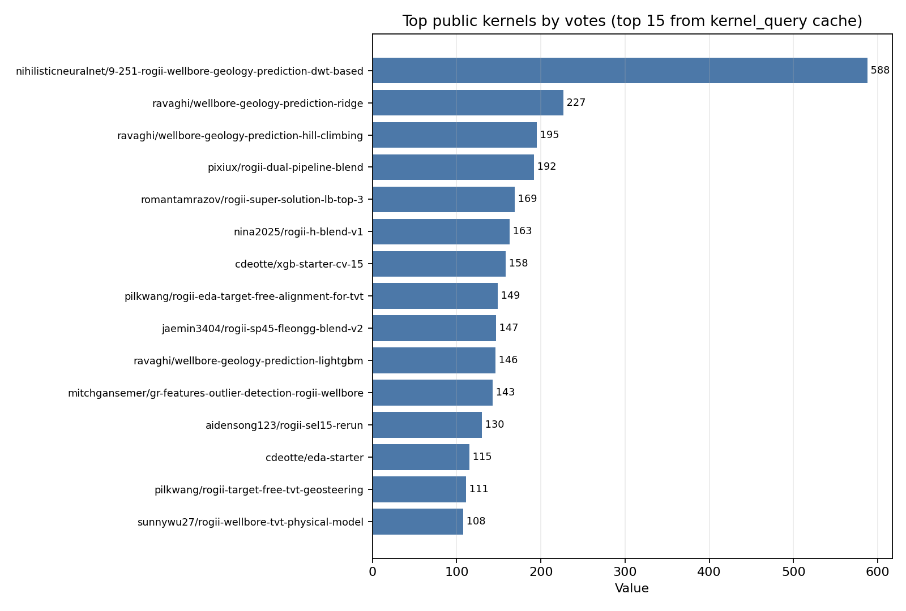
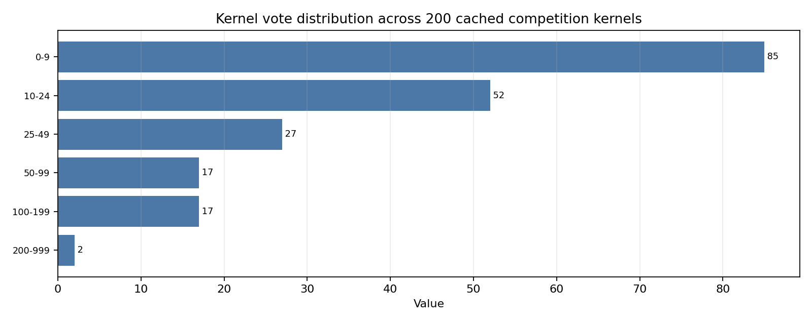
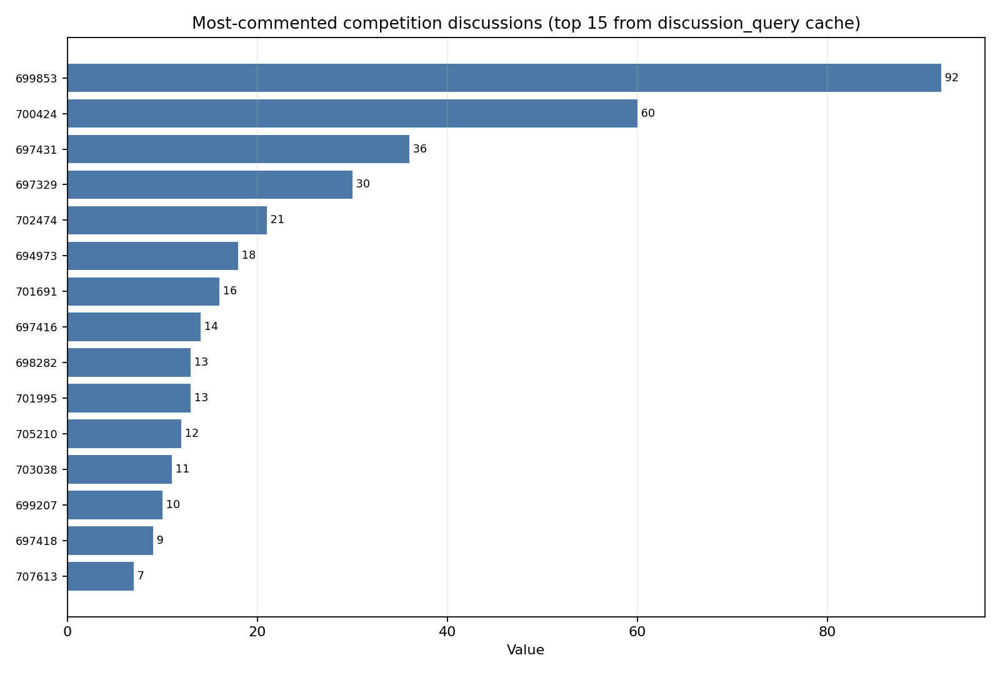
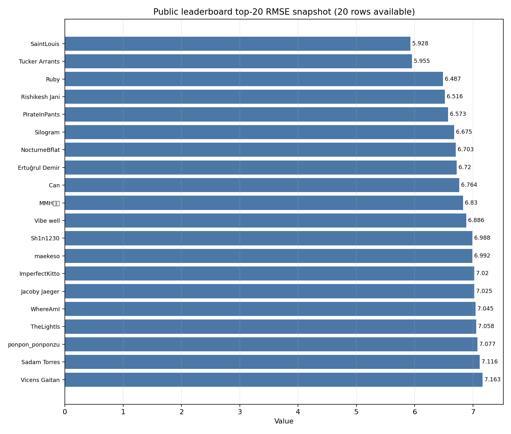

# ROGII Wellbore Geology Prediction — Strategy Brief

Brief generated 2026-06-13 from Kaggle competition overview/dataset pages, Kaggle API kernel/discussion caches, selected public notebook reads, discussion thread reads, and a public leaderboard snapshot. Main competition page: [ROGII - Wellbore Geology Prediction](https://www.kaggle.com/competitions/rogii-wellbore-geology-prediction).

## Executive takeaways

- This is not a plain tabular regression problem. The task is to infer hidden **TVT** along each horizontal well from trajectory, GR, typewell GR-vs-TVT reference, and the known prefix of `TVT_input`; the metric is RMSE and submissions must be Kaggle notebooks with internet disabled and <=9h runtime ([competition page](https://www.kaggle.com/competitions/rogii-wellbore-geology-prediction), [data page](https://www.kaggle.com/competitions/rogii-wellbore-geology-prediction/data)).
- The public kernel ecosystem has converged on **hybrids**: strong TVT continuation baselines + spatial/physics features + typewell alignment signals + GBDT/ridge/NN residual models + blending/hill climbing. Pure XGB/NN starters are useful baselines, not final strategy ([XGB Starter - CV 15](https://www.kaggle.com/code/cdeotte/xgb-starter-cv-15), [NN Starter - CV 15.5](https://www.kaggle.com/code/cdeotte/nn-starter-cv-15-5), [Wellbore Geology Prediction | Ridge](https://www.kaggle.com/code/ravaghi/wellbore-geology-prediction-ridge), [Wellbore Geology Prediction | Hill Climbing](https://www.kaggle.com/code/ravaghi/wellbore-geology-prediction-hill-climbing)).
- The highest-signal notebook to study first is the DWT/DTW-style hybrid: [9.251 ROGII-Wellbore Geology Prediction: DWT-based](https://www.kaggle.com/code/nihilisticneuralnet/9-251-rogii-wellbore-geology-prediction-dwt-based). It combines GroupKFold, Ridge/CatBoost/LightGBM ingredients, particle-filter-like components, formation features, and constrained/stochastic DTW alignment signals.
- The best tactical direction is: build a **validation-stable geosteering stack**, not an LB-chasing blend. Top-20 public leaderboard scores in the snapshot range from 5.928 to 7.163 RMSE, but discussion reports warn that public LB can be noisy and CV/LB gaps can move by >0.7 feet ([cv and lb correlations .....](https://www.kaggle.com/competitions/rogii-wellbore-geology-prediction/discussion/701691)).

## Competition and data facts that shape modeling

- Training wells each have a horizontal-well CSV, a typewell CSV, and a PNG. Horizontal data include `MD`, `X`, `Y`, `Z`, `GR`, formation-surface columns in train, target `TVT`, and `TVT_input`, where the evaluation zone has missing `TVT_input`. Test data has horizontal/typewell CSVs, and the visible test folder is only a few examples; hidden rerun test has about 200 wells ([data page](https://www.kaggle.com/competitions/rogii-wellbore-geology-prediction/data)).
- Typewells are vertical reference logs with `TVT`, `GR`, and `Geology`. The core problem is correlating horizontal GR along measured depth to a vertical GR signature indexed by TVT, while respecting spatial trajectory and geological continuity ([data page](https://www.kaggle.com/competitions/rogii-wellbore-geology-prediction/data), [besides regression, also dwt (time warping)!](https://www.kaggle.com/competitions/rogii-wellbore-geology-prediction/discussion/697431)).
- There are duplicated typewells across different horizontal wells; the organizer explanation is domain-realistic typewell selection and pseudo-typewells from previously interpreted nearby laterals. Treat duplicates as useful metadata/graph structure, not necessarily leakage ([Duplicate type wells for different horizontal wells](https://www.kaggle.com/competitions/rogii-wellbore-geology-prediction/discussion/698449)).
- Private scoring had an outlier-well exclusion/rescore; the organizer said the private-test outlier is excluded from scoring while remaining in test data, so robust per-well behavior matters more than exploiting one anomalous well ([Private Test Update and Rescore](https://www.kaggle.com/competitions/rogii-wellbore-geology-prediction/discussion/707695)).

## What public notebooks are doing

The kernel vote distribution is highly skewed: one DWT-based notebook has 588 votes, only two cached competition kernels exceed 200 votes, and most kernels have <25 votes. That makes the top few notebooks unusually influential but also likely to be heavily forked/blended.

High-signal notebooks:

- [9.251 ROGII-Wellbore Geology Prediction: DWT-based](https://www.kaggle.com/code/nihilisticneuralnet/9-251-rogii-wellbore-geology-prediction-dwt-based): a comprehensive hybrid with formation constants, GroupKFold, Ridge/CatBoost/LightGBM, particle-filter style routines, and DTW radii/stochastic realizations. Study its feature blocks and alignment outputs before copying model weights.
- [Wellbore Geology Prediction | Ridge](https://www.kaggle.com/code/ravaghi/wellbore-geology-prediction-ridge), [Wellbore Geology Prediction | LightGBM](https://www.kaggle.com/code/ravaghi/wellbore-geology-prediction-lightgbm), and [Wellbore Geology Prediction | Hill Climbing](https://www.kaggle.com/code/ravaghi/wellbore-geology-prediction-hill-climbing): simple, strong tabular/artifact/blend baselines. Use these to benchmark residual targets, feature leakage risk, and ensembling mechanics.
- [XGB Starter - [CV 15]](https://www.kaggle.com/code/cdeotte/xgb-starter-cv-15) and [NN Starter - [CV 15.5]](https://www.kaggle.com/code/cdeotte/nn-starter-cv-15-5): clean starter structure. Both model residuals over a last-known-TVt baseline, use full-row trajectory/GR/typewell-alignment features, mask hidden-zone loss, and GroupKFold by well. Keep their data plumbing; replace/extend their geologic signal.
- [ROGII EDA + Target-Free Alignment for TVT](https://www.kaggle.com/code/pilkwang/rogii-eda-target-free-alignment-for-tvt) and [ROGII Target-Free TVT Geosteering](https://www.kaggle.com/code/pilkwang/rogii-target-free-tvt-geosteering): strong conceptual notebooks for target-free alignment, analog wells, local planes, beam paths, PF-style priors, DTW-like matches, and conservative blending.
- [Drift Targeting + NCC: Tree-based ROGII Wellbore](https://www.kaggle.com/code/mitchgansemer/drift-targeting-ncc-tree-based-rogii-wellbore) and [GR Features / Outlier Detection — ROGII Wellbore](https://www.kaggle.com/code/mitchgansemer/gr-features-outlier-detection-rogii-wellbore): focus on normalized cross-correlation/drift targeting and GR/outlier features. These are good feature-engineering sources for a GBDT residual model.
- [ROGII Wellbore TVT — Physical Model](https://www.kaggle.com/code/sunnywu27/rogii-wellbore-tvt-physical-model), [Physics-Informed Baseline](https://www.kaggle.com/code/karnakbaevarthur/physics-informed-baseline), and [ROGII Wellbore Geology | Ridge SP Pipeline](https://www.kaggle.com/code/yuriygreben/rogii-wellbore-geology-ridge-sp-pipeline): useful for physical priors, formation/surface projection, and low-variance ridge pipelines.
- Later public blends such as [rogii_dual_pipeline_blend](https://www.kaggle.com/code/pixiux/rogii-dual-pipeline-blend), [ROGII |🐼 h-blend v1](https://www.kaggle.com/code/nina2025/rogii-h-blend-v1), and [rogii-sp45-fleongg-blend-v2](https://www.kaggle.com/code/jaemin3404/rogii-sp45-fleongg-blend-v2) signal that public leaderboard gains often come from blending multiple public families. Treat them as ensemble references, not as your main source of originality.

## What discussions imply

- The community’s earliest useful framing is “regression plus time warping”: map horizontal MD-GR strips onto the typewell TVT-GR reference via stretch/fold, while exploiting that train/test locations are close enough for regression to work ([besides regression, also dwt (time warping)!](https://www.kaggle.com/competitions/rogii-wellbore-geology-prediction/discussion/697431)).
- The strongest domain argument is that pure tabular models miss spatial/sequential context. A popular thread recommends using the known prefix, local slopes, spatial coordinates, and sequence models or alignment methods rather than treating rows as IID ([Paradigm Shift: Why pure Tabular Models might be hitting a wall](https://www.kaggle.com/competitions/rogii-wellbore-geology-prediction/discussion/699289)).
- A geophysicist’s public notebook/repo reports that global TVT-vs-Z correlation can be misleading until local geometry is accounted for; Q-3D tortuosity helped, while broad well-level AEON features hurt under GroupKFold. This is a strong warning to validate domain features per fold, not by visual plausibility ([A geophysicist's take: domain priors + Q-3D tortuosity](https://www.kaggle.com/competitions/rogii-wellbore-geology-prediction/discussion/702131), [ROGII Wellbore Geology Prediction Toolkit](https://www.kaggle.com/code/mycarta/rogii-wellbore-geology-prediction-toolkit)).
- Test-time/online adaptation was discussed as likely allowed by participants, and reported improvements of roughly 0.15–0.2 RMSE in one thread, but it remains a compute/rules-risk area to implement conservatively inside the 9h notebook limit ([Is online learning / test-time fine-tuning allowed?](https://www.kaggle.com/competitions/rogii-wellbore-geology-prediction/discussion/698002)).
- Do not overtrust public LB. The CV/LB thread includes examples where CV 6.22 scored LB 7.18, and CV around 8 scored 6.6; the public set appears small/noisy, so require fold-level and hard-well validation before adopting blends ([cv and lb correlations .....](https://www.kaggle.com/competitions/rogii-wellbore-geology-prediction/discussion/701691)).

## Leaderboard read

The public top-20 snapshot shows a sharp front cluster: #1 and #2 are 5.928 and 5.955 RMSE, then the next score in the available page is 6.487. That gap suggests the current winning private approaches likely add non-public signal beyond basic public blends: better well grouping, more robust alignment, spatial reconstruction, per-well adaptation, or all of these.

Kaggle API score enrichment for public kernels hit 429 rate limits during this run, so I did **not** include a public-kernel-score plot. Notebook score claims are cited only when present in notebook titles or discussions, not treated as verified exact scores.

## Recommended winning strategy

### 1. Build a leak-safe validation harness first

- Use GroupKFold or StratifiedGroupKFold by well ID; stratify by geometry/azimuth/median TVT if folds are unbalanced. Track RMSE by well, by prediction length, by GR anomaly level, and by duplicate/pseudo-typewell group.
- Create a “hard-well” holdout list from wells where simple baselines, ridge, and alignment disagree. Optimize for mean and tail per-well RMSE, not only pooled RMSE.
- Maintain three validation columns for every candidate: local CV, public LB, and failure cases. Treat LB-only improvements as suspect unless hard-well diagnostics improve.

### 2. Establish strong baselines

- Baseline A: last-known `TVT_input` continuation plus robust recent/global slope vs MD and Z.
- Baseline B: ridge/LightGBM residual over A using only test-available row features, known-prefix summaries, and typewell interpolation features.
- Baseline C: geologic alignment estimate from typewell GR using NCC/DTW/beam search; smooth and constrain it physically.
- Baseline D: physical/spatial surface model from train wells and all test coordinates where allowed; include nearest-neighbor/local-plane formation/surface projections.

### 3. Engineer features around the actual geosteering problem

Prioritize features that explain “where am I in formation?” rather than arbitrary row predictors:

- Known-prefix anchors: final known TVT, final known GR, recent TVT-MD slope, recent TVT-Z slope, curvature, GR trend before prediction start.
- Typewell alignment: interpolated typewell GR at candidate TVT, GR residual to typewell, NCC windows, DTW path TVT, path slope, alignment confidence, alternative alignments at multiple radii/windows.
- Spatial/physics: X/Y/Z, azimuth, inclination proxies, tortuosity, local-plane/surface depth estimates, nearest train/test well features, duplicate typewell group identifiers.
- Robustness: missingness flags, outlier GR flags, per-well normalization, windowed GR quantiles/gradients, disagreement between physical and alignment estimates.

### 4. Model as residuals and blend by confidence

- Train GBDT/ridge/CatBoost/NN models to predict residuals from strong physical/alignment baselines rather than raw TVT. Public starters show this is the right plumbing pattern ([XGB Starter - [CV 15]](https://www.kaggle.com/code/cdeotte/xgb-starter-cv-15), [NN Starter - [CV 15.5]](https://www.kaggle.com/code/cdeotte/nn-starter-cv-15-5)).
- Use monotonic/smoothness post-processing where it matches geology; do not blindly smooth across faults or strong alignment jumps.
- Blend families conditionally: trust DTW/NCC when alignment confidence is high; trust physical/local-plane model when GR is ambiguous; trust residual GBDT when known-prefix features look like train wells.
- Use hill climbing only after you have out-of-fold predictions for each family. Public blends are useful, but final weights should be validation-driven and hard-well-aware.

### 5. Carefully consider transductive/test-time adaptation

- Safe adaptation: compute test-well statistics, build templates from test typewells, infer spatial surfaces using test coordinates, and fit unsupervised/self-supervised alignment features inside the notebook.
- Riskier adaptation: online supervised fine-tuning on visible prefixes. It may help and community reports improvements, but implement with strict train/validation analogs and keep runtime under the 9h limit ([Is online learning / test-time fine-tuning allowed?](https://www.kaggle.com/competitions/rogii-wellbore-geology-prediction/discussion/698002)).

## 10-day execution plan

1. **Day 1:** Reproduce `cdeotte` XGB/NN starters and `ravaghi` Ridge/LightGBM locally; build a single OOF prediction table by row and well.
2. **Day 2:** Add per-well validation diagnostics, duplicate typewell groups, hard-well reports, and CV/LB logging.
3. **Days 3-4:** Implement NCC/DTW alignment features from typewell GR, starting from the DWT and Pilkwang/Mitch notebooks.
4. **Days 5-6:** Add spatial/physics features: nearest wells, local planes, tortuosity, surface/formational priors, and pseudo-typewell group features.
5. **Day 7:** Train ridge/LGBM/CatBoost/XGB residual models and one compact TCN residual model using identical folds.
6. **Day 8:** Build confidence-gated blends and hill-climb using OOF predictions only; inspect hard-well regressions manually.
7. **Day 9:** Add conservative test-time adaptation and ablate it in CV analogs.
8. **Day 10:** Freeze two submissions: one stable CV champion and one slightly more aggressive LB/blend candidate.

## Source and artifact notes

- Kernel cache: 200 competition kernels; votes min 4, max 588, average 33.1, median 11. Top-kernel data came from `kernel_query`/Kaggle API cache.
- Discussion cache: 89 competition discussions; votes min -8, max 126, average 8.2, median 3; 522 comments were fetched for the ingested page set. Discussion plot data came from `discussion_query`/local discussion cache.
- Leaderboard plot uses the 20 rows returned in the visible Kaggle CLI snapshot during this run.
- Plot audit files are in `plots/*.json`, rendered only by the adjacent `plots/*.py` scripts into `plots/*.png`.
