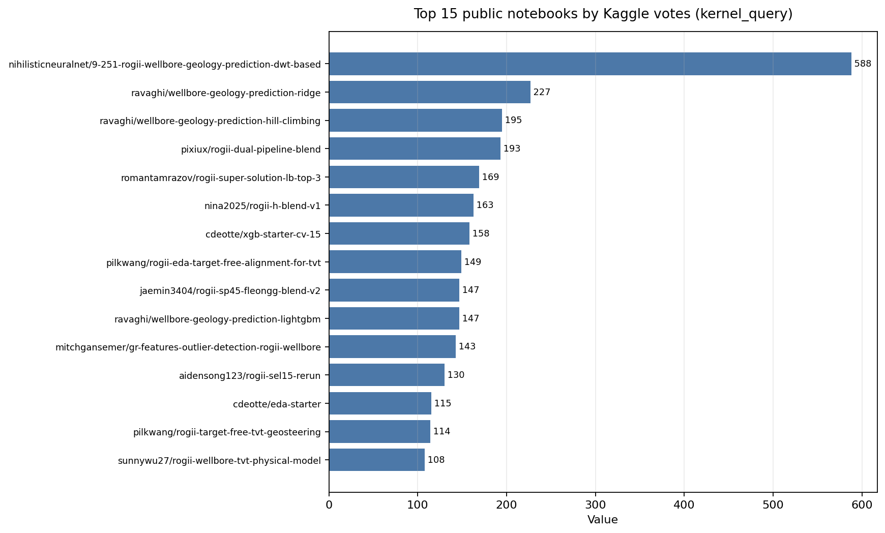
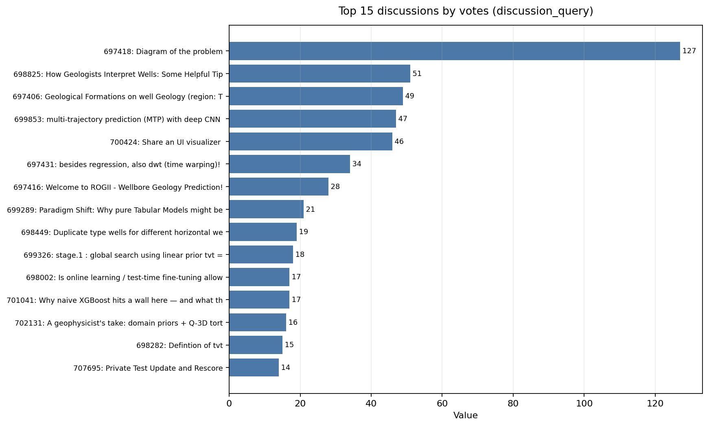
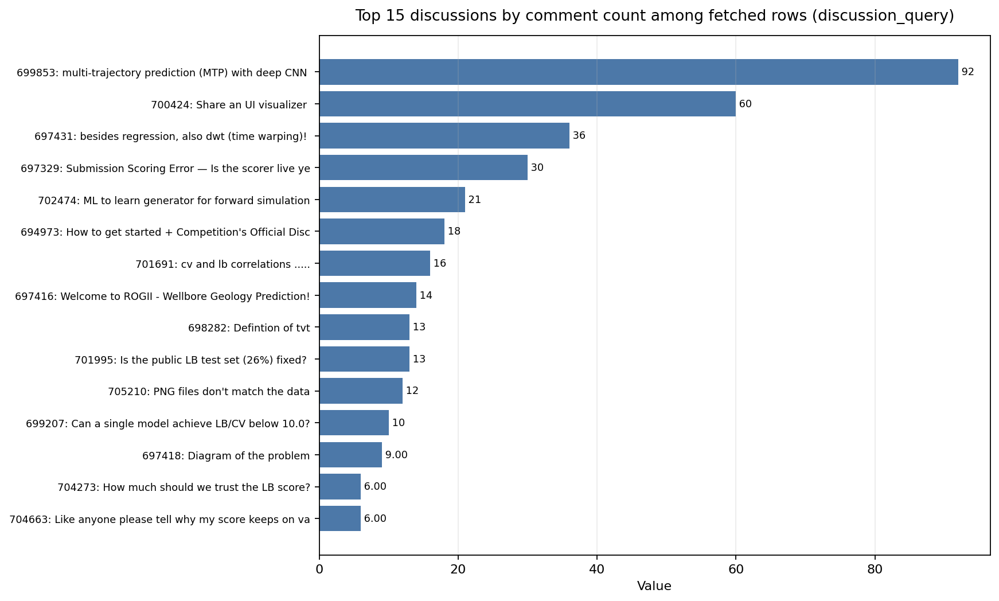
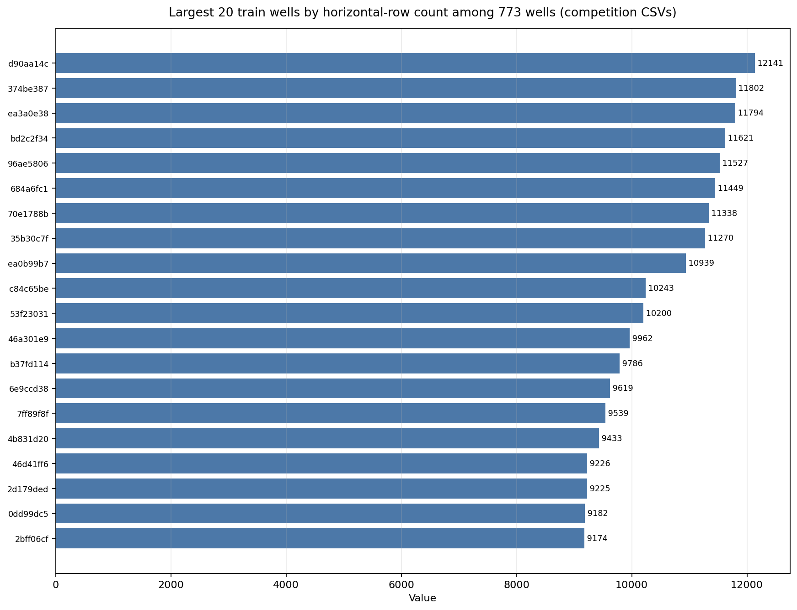
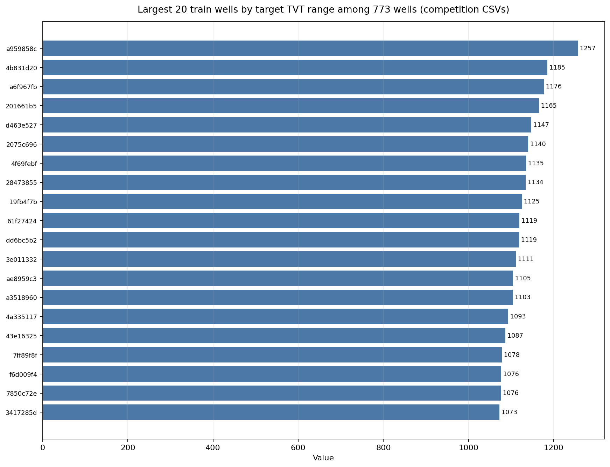

# ROGII - Wellbore Geology Prediction: Strategy Brief

Generated: 2026-06-13 UTC  
Competition: [ROGII - Wellbore Geology Prediction](https://www.kaggle.com/competitions/rogii-wellbore-geology-prediction)  
Research path: `nvidia-kaggle-skill` competition overview, dataset description, kernel ingest/query/read, discussion ingest/query/read, Kaggle dataset download, and auditable plot JSON sidecars.

## Executive takeaways

This is not a generic tabular regression contest. The winning direction is to predict **TVT** along a hidden interval of a horizontal well by combining: (1) a strong anchored baseline from the last visible `TVT_input`, (2) spatial/geological structure from nearby wells and formation surfaces, (3) gamma-ray (`GR`) alignment between the lateral and typewell/known prefix, and (4) conservative ensembling or path post-processing. Public notebooks show that plain GBDTs can get respectable results, but the strongest public work reframes the problem as **geosteering / stratigraphic alignment** rather than row-wise ML.

What it takes to do well:

- Build validation around **wells**, not rows. Use `GroupKFold`/stratified group folds and watch leakage from features computed across hidden rows.
- Start from a strong **last-known TVT / drift residual** baseline, then model corrections. A flat last-known-TVT baseline was reported around local RMSE ~15.9 in Chris Deotte's starter.
- Add **domain-aware features**: formation surfaces (`ANCC`, `ASTNU`, `ASTNL`, `EGFDU`, `EGFDL`, `BUDA` in train), `MD/X/Y/Z`, azimuth, tortuosity, local slopes, known-prefix statistics, row offsets, and GR rolling/lag features.
- Use **sequence alignment**: NCC/DTW/DWT/Viterbi/beam/path search can stabilize the hidden TVT trajectory by matching lateral GR to typewell or known-prefix GR, but raw pointwise GR matching is noisy unless combined with a structural prior.
- Exploit **spatial structure**: the best public notebooks emphasize neighboring wells, formation-plane interpolation, and smooth regional surfaces. Several discussions argue the sub-10 gap is more about problem formulation and spatial/sequential structure than hyperparameter tuning.
- Blend cautiously. Hill climbing and dual-pipeline blends are popular because independently constructed geosteering pipelines have decorrelated errors. Guard physical overrides with prefix self-checks so they only fire when the reconstructed path proves itself.

## Competition facts

- Task: predict `tvt` for every row in the hidden/evaluation zone of horizontal wells.
- Metric: RMSE over submitted `tvt` values.
- Submission: Kaggle Code competition notebook, `submission.csv`, internet disabled, CPU/GPU runtime <= 9 hours.
- Timeline: start May 5, 2026; entry/team merger deadline July 29, 2026; final submission deadline August 5, 2026.
- Public downloaded files at research time: 773 train horizontal wells + 773 train typewells, 3 public test horizontal wells + 3 public test typewells. Hidden/private scoring is handled by Kaggle.
- Dataset profile from local CSVs: 5,092,255 train horizontal rows; median train well length 6,576 rows; max 12,141 rows; median target TVT range ~758 ft; max TVT range ~1,257 ft; median visible `TVT_input` fraction ~26%.
- Organizer update: [Private Test Update and Rescore](https://www.kaggle.com/competitions/rogii-wellbore-geology-prediction/discussion/707695) says an outlier well in the private test set was excluded from scoring on June 11, 2026; the file remains in test data, so runtime should not change.

## Insight plots

Each plot has a matching JSON sidecar in `plots/` with `{title, source, series}` and a `.py` renderer that reads only that JSON.

## Public notebook map

The most useful public notebooks cluster into five families: starters, ridge/GBDT residual models, blend/hill-climb ensembles, target-free geosteering/path alignment, and domain/physics models.

| Notebook | Signal | How to use it |
|---|---:|---|
| [9.251 ROGII-Wellbore Geology Prediction: DWT-based](https://www.kaggle.com/code/nihilisticneuralnet/9-251-rogii-wellbore-geology-prediction-dwt-based) | 588 votes | Highest-vote public DWT/path-alignment reference. Treat as a core geosteering formulation example, not just a model to copy. |
| [Wellbore Geology Prediction \| Ridge](https://www.kaggle.com/code/ravaghi/wellbore-geology-prediction-ridge) | 227 votes | Strong simple residual model; useful for robust feature generation and an ensemble anchor. |
| [Wellbore Geology Prediction \| Hill Climbing](https://www.kaggle.com/code/ravaghi/wellbore-geology-prediction-hill-climbing) | 195 votes | Shows how public solutions are optimized/blended; useful but high overfit risk if validation is weak. |
| [rogii_dual_pipeline_blend](https://www.kaggle.com/code/pixiux/rogii-dual-pipeline-blend) | 193 votes | Blends two geosteering pipelines plus guarded physical override; important pattern for safe special-case logic. |
| [[ROGII] SUPER SOLUTION \|LB: TOP 3](https://www.kaggle.com/code/romantamrazov/rogii-super-solution-lb-top-3) | 169 votes | Public high-ranking inference stack. Inspect for ensemble composition and post-processing. |
| [ROGII \|🐼 h-blend v1](https://www.kaggle.com/code/nina2025/rogii-h-blend-v1) | 163 votes | Another high-vote blend reference; compare with hill-climb and dual-pipeline blend. |
| [XGB Starter - [CV 15]](https://www.kaggle.com/code/cdeotte/xgb-starter-cv-15) | 158 votes | Clean baseline: per-well context, typewell GR correlation, GroupKFold by well, residual on last-known TVT. |
| [🛢️ ROGII EDA + Target-Free Alignment for TVT](https://www.kaggle.com/code/pilkwang/rogii-eda-target-free-alignment-for-tvt) | 149 votes | Rich EDA + target-free physics/GR/spatial priors; especially useful for understanding leakage-safe alignment. |
| [Wellbore Geology Prediction \| LightGBM](https://www.kaggle.com/code/ravaghi/wellbore-geology-prediction-lightgbm) | 147 votes | GBDT complement to Ridge; good for feature importance and blend diversity. |
| [GR Features / Outlier Detection — ROGII Wellbore](https://www.kaggle.com/code/mitchgansemer/gr-features-outlier-detection-rogii-wellbore) | 143 votes | Focused GR feature and anomaly handling reference. |
| [EDA Starter](https://www.kaggle.com/code/cdeotte/eda-starter) | 115 votes | Quick route to data shape, columns, and geometry intuition. |
| [🧭 ROGII Target-Free TVT Geosteering](https://www.kaggle.com/code/pilkwang/rogii-target-free-tvt-geosteering) | 114 votes | Geosteering-specific formulation; pair with the longer EDA/alignment notebook. |
| [ROGII Wellbore TVT — Physical Model](https://www.kaggle.com/code/sunnywu27/rogii-wellbore-tvt-physical-model) | 108 votes | Physics baseline/override ideas; useful as a diagnostic even if not final. |
| [Drift Targeting + NCC: Tree-based ROGII Wellbore](https://www.kaggle.com/code/mitchgansemer/drift-targeting-ncc-tree-based-rogii-wellbore) | 108 votes | NCC + drift formulation; good bridge between tabular and alignment methods. |
| [NN Starter - [CV 15.5]](https://www.kaggle.com/code/cdeotte/nn-starter-cv-15-5) | 107 votes | Neural baseline; useful for sequence/DL experiments, but not sufficient alone without formulation work. |
| [ROGII Wellbore Geology \| Ridge SP Pipeline](https://www.kaggle.com/code/yuriygreben/rogii-wellbore-geology-ridge-sp-pipeline) | 103 votes | Ridge/spatial-pipeline variant; useful for low-variance blending. |
| [Physics-Informed Baseline](https://www.kaggle.com/code/karnakbaevarthur/physics-informed-baseline) | 100 votes | Good sanity-check model for physically plausible TVT paths. |
| [AeroRidge Engine v2](https://www.kaggle.com/code/svanikkolli/aeroridge-engine-v2) | 94 votes | Another ridge-style engine for blend diversity. |

Note: the `fetch_top_kernel_scores` workflow hit Kaggle API rate limit `429`, so this brief uses notebook vote/query metadata and notebook content, not freshly verified public-score rows. Scores embedded in notebook titles are treated as notebook claims, not independently verified scores.

## High-signal discussions

| Discussion | Signal |
|---|---|
| [Diagram of the problem](https://www.kaggle.com/competitions/rogii-wellbore-geology-prediction/discussion/697418) | Best visual intuition for the task. Start here before modeling. |
| [How Geologists Interpret Wells: Some Helpful Tips](https://www.kaggle.com/competitions/rogii-wellbore-geology-prediction/discussion/698825) | Organizer/domain hints: lateral GR before prediction start can be higher-resolution than typewell GR; use known-prefix lateral GR correlation. |
| [multi-trajectory prediction (MTP) with deep CNN for welllog inversion](https://www.kaggle.com/competitions/rogii-wellbore-geology-prediction/discussion/699853) | Deep/path-query formulation and MTP ideas; one of the most commented threads. |
| [Share an UI visualizer](https://www.kaggle.com/competitions/rogii-wellbore-geology-prediction/discussion/700424) | UI visualizer + glossary advice; useful for manual debugging and understanding TVT as “floor number” in a geological building. |
| [besides regression, also dwt (time warping)!](https://www.kaggle.com/competitions/rogii-wellbore-geology-prediction/discussion/697431) | Early and influential dynamic/time-warping framing: match horizontal MD-GR strip to typewell TVT-GR. |
| [Paradigm Shift: Why pure Tabular Models might be hitting a wall](https://www.kaggle.com/competitions/rogii-wellbore-geology-prediction/discussion/699289) | Community consensus that spatial + sequential context matters more than another row-wise tabular tweak. |
| [Duplicate type wells for different horizontal wells](https://www.kaggle.com/competitions/rogii-wellbore-geology-prediction/discussion/698449) | Important data relationship: do not assume one typewell uniquely identifies one target context. |
| [stage.1 : global search using linear prior tvt = linear(md,z)](https://www.kaggle.com/competitions/rogii-wellbore-geology-prediction/discussion/699326) | Linear prior/global-search baseline; useful as a path-search initializer. |
| [Is online learning / test-time fine-tuning allowed?](https://www.kaggle.com/competitions/rogii-wellbore-geology-prediction/discussion/698002) | Check rules before adapting on test rows or public test structure. |
| [Why naive XGBoost hits a wall here — and what the literature suggests instead](https://www.kaggle.com/competitions/rogii-wellbore-geology-prediction/discussion/701041) | Argument for moving beyond naive GBDT into sequence/geology-aware formulation. |
| [A geophysicist's take: domain priors + Q-3D tortuosity](https://www.kaggle.com/competitions/rogii-wellbore-geology-prediction/discussion/702131) | Domain feature ideas: tortuosity, signed azimuth, spatial validation choices, toolkit repo. |
| [Defintion of tvt](https://www.kaggle.com/competitions/rogii-wellbore-geology-prediction/discussion/698282) | Clarifies target semantics; worth reading before feature engineering. |
| [cv and lb correlations .....](https://www.kaggle.com/competitions/rogii-wellbore-geology-prediction/discussion/701691) | Useful public CV/LB anecdotes: GroupKFold-by-well can be stable, but leakage can make CV-LB gaps misleading. |
| [Can a single model achieve LB/CV below 10.0?](https://www.kaggle.com/competitions/rogii-wellbore-geology-prediction/discussion/699207) | Community comments suggest sub-10 is possible with a single well-formulated model, but simple CatBoost/GBDT plateaus. |
| [Private Test Update and Rescore](https://www.kaggle.com/competitions/rogii-wellbore-geology-prediction/discussion/707695) | Private scoring caveat: outlier private test well excluded from scoring on June 11, 2026. |

## Modeling strategy

### 1. Build a leakage-safe baseline first

Minimum viable baseline:

1. For each well, identify the hidden interval where `TVT_input` is missing.
2. Use last visible `TVT_input` as an anchor.
3. Create residual targets: `target_residual = TVT - last_known_TVT`.
4. Train a model only on hidden-like rows from train wells.
5. Validate with well-level groups, not row-level random splits.

Feature groups to include:

- Position and geometry: `MD`, row index, distance from prediction start, `X/Y/Z`, deltas from anchor, local slopes, azimuth, curvature/tortuosity.
- Known-prefix stats: min/max/mean/std/range/slope of visible `TVT_input`, visible `GR`, recent-window versions, last-known values.
- Formation context: train-only surface depths and engineered relative positions; for test, infer analogous structure via typewell/neighbor features and public pipeline ideas.
- Typewell alignment: typewell `TVT`/`GR` interpolation at baseline TVT, offsets around baseline TVT, GR residuals, NCC windows, nearest matching windows.
- Robustness flags: missing GR, outlier GR, discontinuities, duplicated typewell IDs, unusually large predicted drift.

Use XGB/LGB/Ridge as fast iteration models. Treat them as diagnostic engines for feature value, not necessarily final solvers.

### 2. Add spatial structure

The recurring public lesson is that the hidden path is constrained by regional geology. Good solutions should estimate a smooth TVT surface or drift field from nearby wells and formations, then let local GR/path matching adjust it.

Practical options:

- KNN over well coordinates using known train wells and/or prefix geometry.
- Local formation-plane fits around each test well.
- Spatial pooling features: neighbor target summaries, neighbor residual summaries, typewell similarity, coordinate-normalized surfaces.
- Stratified validation by spatial/azimuth/median-TVT bins to avoid trusting a fold split that is accidentally too easy.
- Blend spatial and non-spatial models separately; their errors can decorrelate.

Failure mode: pure global `TVT ~ Z` looks strong across wells but can fail within a horizontal lateral. Domain discussion reports global TVT-vs-Z dominated by cross-well structural elevation, while within-lateral slope can be near zero or even misleading.

### 3. Add sequence/path alignment

The sequence view: choose a plausible TVT state for each hidden MD row so that lateral GR aligns with typewell/known-prefix GR while the TVT path remains smooth.

Useful formulations:

- NCC around candidate TVT windows.
- DTW/DWT/dynamic warping between lateral GR and typewell GR.
- Viterbi/beam search over discrete TVT states with observation + movement costs.
- Multi-trajectory prediction: keep top-k path hypotheses, then score/blend them.
- Particle-filter style priors or smoothness constraints.

Critical caveats:

- Raw GR scale matters. If the observation cost uses z-scored GR while movement penalties are in raw units, the path can become artificially flat.
- Single-point GR is a weak discriminator. Use windows, prefix self-correlation, typewell context, and spatial priors.
- Over-aggressive alignment can overfit public LB. Prefer guarded corrections that retreat to the stable base when confidence is low.

### 4. Blend and post-process conservatively

Useful blend families:

- Ridge/GBDT residual models.
- Spatial/formation-plane models.
- DTW/DWT/Viterbi path models.
- Physical/geometry overrides that self-validate against the known prefix.
- Public blend references/hill-climbing as benchmarks, not final truth.

Post-processing checks:

- TVT path smoothness and physically plausible increments.
- No wild jumps unless GR/formation evidence supports them.
- Clip or damp corrections far from validation distribution.
- Compare multiple paths: if models disagree strongly, fall back toward a conservative anchor.
- Ensure submission rows match `sample_submission.csv` IDs exactly.

## Validation plan

Recommended progression:

1. **GroupKFold by well** for early feature/model iteration.
2. **StratifiedGroupKFold** using well-level summaries: signed azimuth, median TVT, spatial bin, TVT range, row count.
3. **Spatial stress folds**: hold out regions or neighbor clusters to see whether a spatial method is memorizing local structure.
4. **Prefix simulation**: for each train well, mimic test by hiding the same fraction/pattern as test and score only hidden rows.
5. **Component ablations**: last-known baseline, tabular residual, spatial prior, GR alignment, path search, blend/post-process.
6. **LB discipline**: public LB is small and can be special-cased; keep a private local ranking and avoid hill-climb-only progress.

Validation warning signs:

- Row-random CV much lower than GroupKFold CV.
- Feature values computed from future hidden rows.
- Strong CV gains from features unavailable for test or leaked from `TVT`.
- Public LB gains that do not reproduce across well-group folds.
- Path methods that become flat or jumpy because cost scales are mismatched.

## Execution checklist

A high-performing entrant should be able to answer “yes” to most of these:

- I can reproduce a clean baseline like the XGB/Ridge starter with well-group validation.
- I know which rows are hidden-like in train and only train target models on comparable rows.
- I have a visualizer for individual wells and can overlay `TVT`, `TVT_input`, predicted TVT, `GR`, typewell GR, and formation surfaces.
- I have at least one spatial prior model and one sequence-alignment model.
- I have ablations showing spatial and alignment components add value independently.
- I have confidence metrics for path predictions and fallbacks when confidence is low.
- I have a strict submission builder tested against `sample_submission.csv`.
- I can run the full notebook under 9 hours with internet disabled.

## Suggested next experiments

1. Reproduce three baselines locally: [XGB Starter - [CV 15]](https://www.kaggle.com/code/cdeotte/xgb-starter-cv-15), [Wellbore Geology Prediction \| Ridge](https://www.kaggle.com/code/ravaghi/wellbore-geology-prediction-ridge), and [🛢️ ROGII EDA + Target-Free Alignment for TVT](https://www.kaggle.com/code/pilkwang/rogii-eda-target-free-alignment-for-tvt).
2. Build a single fold harness that can evaluate row-wise residual, spatial prior, and path-alignment outputs on exactly the same hidden rows.
3. Implement a formation-plane/neighbor feature block and compare against pure tabular features.
4. Implement NCC/DTW/Viterbi path candidates with raw-GR observation costs and explicit movement penalties.
5. Blend only models that improve out-of-fold residuals and show decorrelated error by well.
6. Add a per-well visualization notebook to manually inspect the worst 20 OOF wells by RMSE and the largest predicted jumps.

## Source artifacts

- Raw competition overview: `raw/competition_overview.md`
- Raw dataset description: `raw/dataset_description.md`
- Kernel query output: `raw/top_kernels.json`
- Discussion query output: `raw/top_discussions.json`
- Read notebook caches: `raw/kernel_*.md`
- Read discussion caches: `raw/discussion_*.md`
- Dataset profile summary: `raw/dataset_profile_summary.json`
- Plot sidecars/renderers/images: `plots/*.json`, `plots/*.py`, `plots/*.png`

