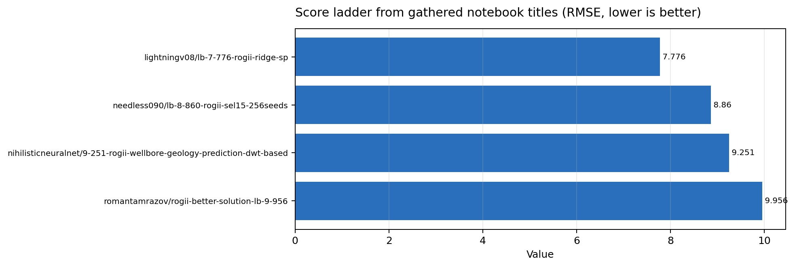
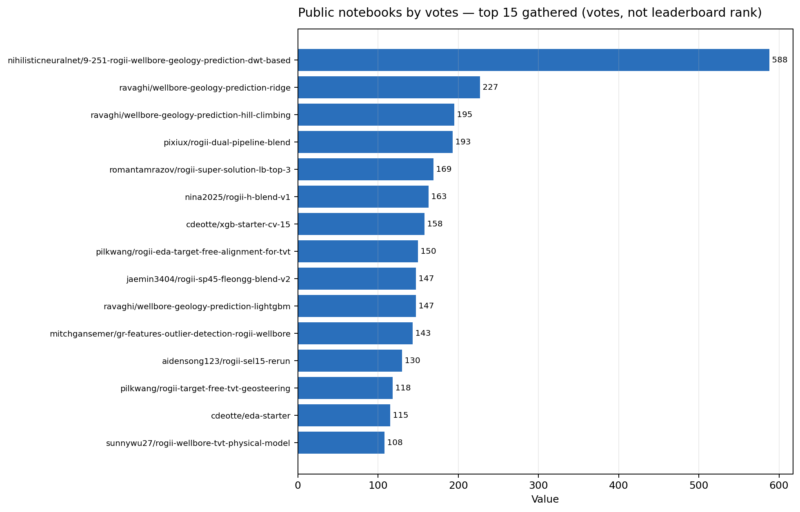
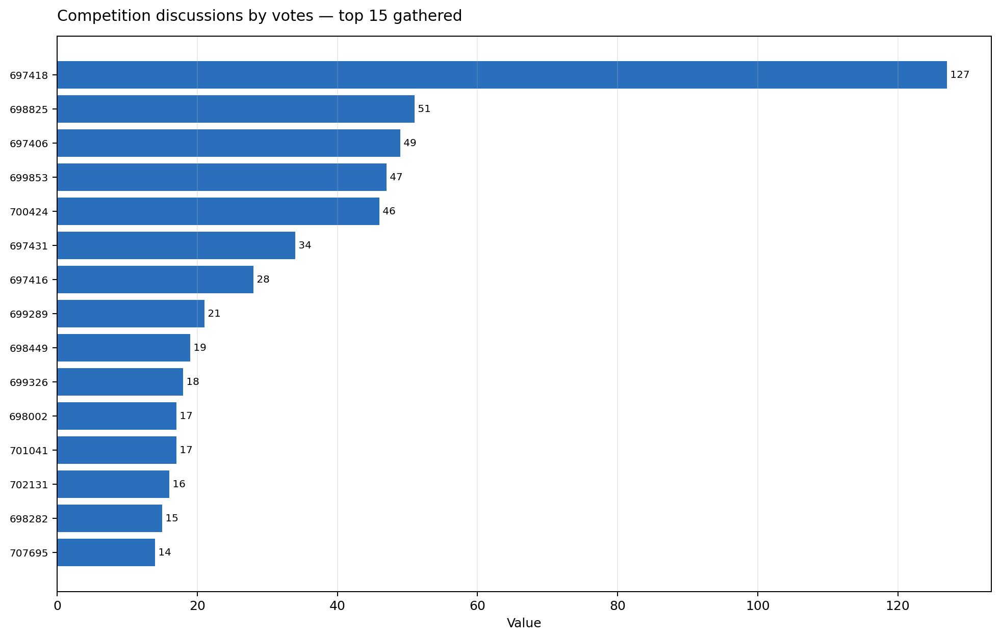
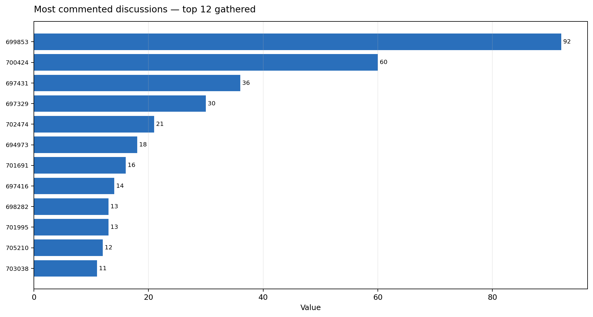

# ROGII Wellbore Geology Prediction — Strategy Brief

Researched with the NVIDIA Kaggle skill on 2026-06-13 from the Kaggle competition page, dataset tab, public notebooks, and discussions. Competition: [ROGII - Wellbore Geology Prediction](https://www.kaggle.com/competitions/rogii-wellbore-geology-prediction).

## Executive takeaways

- This is not a plain tabular regression contest. The target is hidden-tail `tvt` along each horizontal well, anchored by known `TVT_input`, trajectory geometry, gamma-ray (`GR`) logs, formation surfaces, and an associated vertical typewell.
- The core winning formulation is geological alignment: infer a plausible TVT path through the hidden section by matching horizontal-well GR signatures to typewell GR signatures, then use ML/ensembles to correct residuals.
- Public notebooks show the ladder moving from starter residual GBDT/NN models such as [XGB Starter - CV 15](https://www.kaggle.com/code/cdeotte/xgb-starter-cv-15) and [NN Starter - CV 15.5](https://www.kaggle.com/code/cdeotte/nn-starter-cv-15-5) to alignment/physics/ensemble notebooks such as [9.251 DWT-based](https://www.kaggle.com/code/nihilisticneuralnet/9-251-rogii-wellbore-geology-prediction-dwt-based), [LB 7.776 rogii-ridge-sp](https://www.kaggle.com/code/lightningv08/lb-7-776-rogii-ridge-sp), and [SUPER SOLUTION | LB: TOP 3](https://www.kaggle.com/code/romantamrazov/rogii-super-solution-lb-top-3).
- Treat the public leaderboard carefully. The API score fetch was rate-limited in this run, and forum evidence says public LB is noisy because the public test set has a small number of wells; use well-grouped CV plus stress tests, not LB alone.

## Competition mechanics that shape strategy

- **Task:** predict `tvt` (True Vertical Thickness, ft) for hidden/evaluation rows in each horizontal well; submission rows are `id,tvt`.
- **Metric:** RMSE over submitted row-level `tvt` predictions, lower is better.
- **Data:** `train/` contains per-well horizontal CSVs, associated typewell CSVs, and PNG visualizations; `test/` visible files are examples and are replaced by hidden test wells at rerun time. The dataset tab reports 2,327 files totaling 1.33 GB.
- **Per horizontal well:** `MD`, `X`, `Y`, `Z`, training-only formation depth surfaces (`ANCC`, `ASTNU`, `ASTNL`, `EGFDU`, `EGFDL`, `BUDA`), `GR`, and `TVT_input`, where `TVT_input` is known before the evaluation zone and `NaN` in the hidden tail.
- **Per typewell:** `TVT`, `GR`, and categorical `Geology`; this is the reference vertical signature used for correlation/alignment.
- **Submission constraints:** notebook-only; CPU or GPU notebook runtime must be ≤ 9 hours; internet disabled; `submission.csv` required; public external data/pretrained models are allowed if freely and publicly available.
- **Timeline:** start May 5, 2026; entry/team merger deadline July 29, 2026; final submission deadline August 5, 2026, all at 23:59 UTC unless changed.

## Score ladder from gathered evidence

Public kernel score lookup through the Kaggle SDK returned HTTP 429 in this run, so this ladder uses only concrete CV/LB numbers visible in gathered notebook titles and discussion text. Notebook votes are not leaderboard rank.

| Rung | Evidence | What it implies |
|---|---:|---|
| Starter tree residuals | [XGB Starter - CV 15](https://www.kaggle.com/code/cdeotte/xgb-starter-cv-15) title says CV 15; discussion reports plain GBDTs around CV 11 / LB 9.6. | Good baseline, but not enough for top contention. |
| Starter neural net | [NN Starter - CV 15.5](https://www.kaggle.com/code/cdeotte/nn-starter-cv-15-5) title says CV 15.5. | Naive NN is not automatically better; sequence formulation matters. |
| Early single-model / feature-engineered solutions | [cv and lb correlations](https://www.kaggle.com/competitions/rogii-wellbore-geology-prediction/discussion/701691): examples include CV 10–11 with LB around 9–10; comments mention single models at LB 9.463 and 8.8. | Sub-10 LB is reachable, but correlation is imperfect. |
| Public alignment notebook | [9.251 DWT-based](https://www.kaggle.com/code/nihilisticneuralnet/9-251-rogii-wellbore-geology-prediction-dwt-based) embeds 9.251 in the title. | Dynamic/time-warped GR alignment is a meaningful step beyond generic tabular. |
| Strong public solution notebooks | [LB 8.860 sel15](https://www.kaggle.com/code/needless090/lb-8-860-rogii-sel15-256seeds), [LB 7.776 ridge-sp](https://www.kaggle.com/code/lightningv08/lb-7-776-rogii-ridge-sp), and [LB TOP 3](https://www.kaggle.com/code/romantamrazov/rogii-super-solution-lb-top-3). | High public notebooks combine alignment/physics candidates, residual modeling, and ensembling/blending. |
| Long-run target | [cv and lb correlations](https://www.kaggle.com/competitions/rogii-wellbore-geology-prediction/discussion/701691) includes reports around CV 6.7 / LB 6.3 and CV 6.22 / LB 7.18, plus warnings that LB can swing. | The frontier is likely validation robustness and generalization to hidden wells, not just squeezing public LB. |

## What the strongest public notebooks are doing

1. **Anchor on the last known interpretation.** The [XGB starter](https://www.kaggle.com/code/cdeotte/xgb-starter-cv-15) explicitly models residuals over the final known `TVT_input` value and builds per-well context features from the known prefix. This is the minimum sane baseline because hidden-tail TVT should evolve smoothly from the observed prefix anchor.
2. **Respect well identity in validation.** Multiple notebooks import/use `GroupKFold` by well, including [XGB starter](https://www.kaggle.com/code/cdeotte/xgb-starter-cv-15) and [DWT-based](https://www.kaggle.com/code/nihilisticneuralnet/9-251-rogii-wellbore-geology-prediction-dwt-based). Forum comments in [cv and lb correlations](https://www.kaggle.com/competitions/rogii-wellbore-geology-prediction/discussion/701691) warn that many public notebooks leak, making CV/LB gaps misleading.
3. **Exploit typewell GR alignment.** The public EDA/alignment notebook [Target-Free Alignment for TVT](https://www.kaggle.com/code/pilkwang/rogii-eda-target-free-alignment-for-tvt) describes a matrix built from target-free physics, GR, and spatial priors; its feature map includes anchor/prefix TVT, trajectory, GR texture, typewell/physics paths, formation planes, and row-level formation surfaces.
4. **Use dynamic/warped paths, not only row features.** [DWT-based](https://www.kaggle.com/code/nihilisticneuralnet/9-251-rogii-wellbore-geology-prediction-dwt-based) implements constrained DTW/Sakoe-Chiba paths, stochastic DTW realizations, beam candidates, particle-filter-like path features, Ridge/CatBoost/LightGBM components, and hill-climbing/blending.
5. **Add physics and geosteering priors.** [TVT Physical Model](https://www.kaggle.com/code/sunnywu27/rogii-wellbore-tvt-physical-model), [Physics-Informed Baseline](https://www.kaggle.com/code/karnakbaevarthur/physics-informed-baseline), [Target-Free TVT Geosteering](https://www.kaggle.com/code/pilkwang/rogii-target-free-tvt-geosteering), and [Drift Targeting + NCC](https://www.kaggle.com/code/mitchgansemer/drift-targeting-ncc-tree-based-rogii-wellbore) all point toward explicit path/drift/normalised-cross-correlation style reasoning instead of treating each row independently.
6. **Blend diverse hypotheses.** The public high-vote solutions include [Ridge](https://www.kaggle.com/code/ravaghi/wellbore-geology-prediction-ridge), [LightGBM](https://www.kaggle.com/code/ravaghi/wellbore-geology-prediction-lightgbm), [Hill Climbing](https://www.kaggle.com/code/ravaghi/wellbore-geology-prediction-hill-climbing), [Dual Pipeline Blend](https://www.kaggle.com/code/pixiux/rogii-dual-pipeline-blend), and [SUPER SOLUTION](https://www.kaggle.com/code/romantamrazov/rogii-super-solution-lb-top-3). The pattern is to produce multiple candidate TVT paths/predictions, then stack or hill-climb weights rather than relying on one model family.

## Public notebooks to study

- [nihilisticneuralnet/9-251-rogii-wellbore-geology-prediction-dwt-based](https://www.kaggle.com/code/nihilisticneuralnet/9-251-rogii-wellbore-geology-prediction-dwt-based) — DWT/DTW, stochastic path candidates, particle-filter-like features, model blend; title score 9.251.
- [ravaghi/wellbore-geology-prediction-ridge](https://www.kaggle.com/code/ravaghi/wellbore-geology-prediction-ridge) — Ridge baseline/artifact path that many later public notebooks build on.
- [ravaghi/wellbore-geology-prediction-lightgbm](https://www.kaggle.com/code/ravaghi/wellbore-geology-prediction-lightgbm) — Tree-based companion baseline for residual/geological features.
- [ravaghi/wellbore-geology-prediction-hill-climbing](https://www.kaggle.com/code/ravaghi/wellbore-geology-prediction-hill-climbing) — Hill-climbing blend mechanics for public prediction artifacts.
- [pixiux/rogii-dual-pipeline-blend](https://www.kaggle.com/code/pixiux/rogii-dual-pipeline-blend) — Example of blending two public pipelines.
- [romantamrazov/rogii-super-solution-lb-top-3](https://www.kaggle.com/code/romantamrazov/rogii-super-solution-lb-top-3) — High-public-rank blend notebook; use cautiously as a public solution artifact, not as a full explanation.
- [pilkwang/rogii-eda-target-free-alignment-for-tvt](https://www.kaggle.com/code/pilkwang/rogii-eda-target-free-alignment-for-tvt) — Most useful conceptual source for target-free alignment and feature taxonomy.
- [pilkwang/rogii-target-free-tvt-geosteering](https://www.kaggle.com/code/pilkwang/rogii-target-free-tvt-geosteering) — Geosteering/path-search formulation.
- [sunnywu27/rogii-wellbore-tvt-physical-model](https://www.kaggle.com/code/sunnywu27/rogii-wellbore-tvt-physical-model) — Physical TVT path model.
- [mitchgansemer/drift-targeting-ncc-tree-based-rogii-wellbore](https://www.kaggle.com/code/mitchgansemer/drift-targeting-ncc-tree-based-rogii-wellbore) — NCC/drift targeting with tree models.
- [mitchgansemer/gr-features-outlier-detection-rogii-wellbore](https://www.kaggle.com/code/mitchgansemer/gr-features-outlier-detection-rogii-wellbore) — GR feature engineering and outlier analysis.
- [cdeotte/xgb-starter-cv-15](https://www.kaggle.com/code/cdeotte/xgb-starter-cv-15) — Clean starter: GroupKFold, residual over last-known TVT, typewell correlation features.
- [cdeotte/nn-starter-cv-15-5](https://www.kaggle.com/code/cdeotte/nn-starter-cv-15-5) — Useful reference for NN baseline limitations.
- [yuriygreben/rogii-wellbore-geology-ridge-sp-pipeline](https://www.kaggle.com/code/yuriygreben/rogii-wellbore-geology-ridge-sp-pipeline) — Ridge/SP style public pipeline.
- [karnakbaevarthur/physics-informed-baseline](https://www.kaggle.com/code/karnakbaevarthur/physics-informed-baseline) — Physics-informed baseline with public helper artifacts.
- [lightningv08/lb-7-776-rogii-ridge-sp](https://www.kaggle.com/code/lightningv08/lb-7-776-rogii-ridge-sp) — Concrete strong public score in title: LB 7.776.
- [needless090/lb-8-860-rogii-sel15-256seeds](https://www.kaggle.com/code/needless090/lb-8-860-rogii-sel15-256seeds) — Concrete public score in title: LB 8.860.

## Key discussions

- [Diagram of the problem](https://www.kaggle.com/competitions/rogii-wellbore-geology-prediction/discussion/697418) — visual explanation of the task setup; highest-voted discussion gathered.
- [How Geologists Interpret Wells: Some Helpful Tips](https://www.kaggle.com/competitions/rogii-wellbore-geology-prediction/discussion/697665) — domain framing for geological interpretation.
- [besides regression, also dwt (time warping)!](https://www.kaggle.com/competitions/rogii-wellbore-geology-prediction/discussion/698449) — early push toward DWT/DTW/time-warping formulation; comments mention simple LGB around LB 9.7 and problem-formulation importance.
- [Can a single model achieve LB/CV below 10.0?](https://www.kaggle.com/competitions/rogii-wellbore-geology-prediction/discussion/699326) — evidence that sub-10 can come from good single models, but formulation is key.
- [cv and lb correlations](https://www.kaggle.com/competitions/rogii-wellbore-geology-prediction/discussion/701691) — most useful validation caution: GroupKFold, noisy public LB, leakage warnings, and CV/LB examples.
- [A geophysicist's take: domain priors + Q-3D tortuosity](https://www.kaggle.com/competitions/rogii-wellbore-geology-prediction/discussion/702131) — domain-prior and CV design ideas including tortuosity and stratified GroupKFold.
- [Is online learning / test-time fine-tuning allowed?](https://www.kaggle.com/competitions/rogii-wellbore-geology-prediction/discussion/699207) — important rules/ethics area to verify before any TTA/online learning idea.
- [Private Test Update and Rescore](https://www.kaggle.com/competitions/rogii-wellbore-geology-prediction/discussion/707695) — organizer note that an outlier private-test well was excluded from scoring; private robustness matters.

## Recommended implementation path

1. **Reproduce a leak-safe starter.** Start from [XGB starter](https://www.kaggle.com/code/cdeotte/xgb-starter-cv-15) and implement a local evaluation harness with wells as groups. Predict residuals from the last known `TVT_input`, not absolute TVT from scratch.
2. **Create well-level split diagnostics.** Track RMSE by well, tail length, GR volatility, trajectory curvature/tortuosity, and formation depth context. Do not trust row-random CV or folds that put the same well in train and validation.
3. **Build target-free alignment candidates.** Recreate the alignment ideas in [Target-Free Alignment](https://www.kaggle.com/code/pilkwang/rogii-eda-target-free-alignment-for-tvt): match horizontal-tail `GR` to typewell `GR` under monotone TVT movement, generate multiple candidate paths, and score path plausibility from GR similarity, smoothness, endpoint, and trajectory/geology priors.
4. **Add DTW/NCC/beam/particle-style features.** Use [DWT-based](https://www.kaggle.com/code/nihilisticneuralnet/9-251-rogii-wellbore-geology-prediction-dwt-based), [Drift Targeting + NCC](https://www.kaggle.com/code/mitchgansemer/drift-targeting-ncc-tree-based-rogii-wellbore), and [Geosteering](https://www.kaggle.com/code/pilkwang/rogii-target-free-tvt-geosteering) as references. The output should be several plausible TVT paths per hidden tail plus confidence features, not one brittle alignment.
5. **Train residual models over candidate paths.** Feed anchor/prefix stats, trajectory increments, GR rolls/leads/lags, formation-surface distances, typewell/path scores, and candidate endpoints into Ridge/LightGBM/CatBoost/XGB. Public examples: [Ridge](https://www.kaggle.com/code/ravaghi/wellbore-geology-prediction-ridge), [LightGBM](https://www.kaggle.com/code/ravaghi/wellbore-geology-prediction-lightgbm), and [DWT-based](https://www.kaggle.com/code/nihilisticneuralnet/9-251-rogii-wellbore-geology-prediction-dwt-based).
6. **Blend hypotheses with out-of-fold discipline.** Use OOF predictions from distinct formulations before hill-climbing/blending; study [Hill Climbing](https://www.kaggle.com/code/ravaghi/wellbore-geology-prediction-hill-climbing), [Dual Pipeline Blend](https://www.kaggle.com/code/pixiux/rogii-dual-pipeline-blend), and [SUPER SOLUTION](https://www.kaggle.com/code/romantamrazov/rogii-super-solution-lb-top-3). Avoid tuning weights purely to public LB.
7. **Engineer for notebook rerun constraints.** Precompute only what rules allow via public datasets; keep inference deterministic, under 9 hours, internet-free, and robust to hidden test wells replacing the visible sample test set.

## Validation risks and anti-patterns

- **Leakage:** [cv and lb correlations](https://www.kaggle.com/competitions/rogii-wellbore-geology-prediction/discussion/701691) explicitly warns that public notebooks can have leakage and smaller CV/LB gaps. Any feature derived from validation/test hidden TVT, test IDs, or public submission artifacts should be isolated from your real OOF estimate.
- **Public-LB overfit:** The same discussion reports examples where CV improvements of ~0.7 ft regressed on LB, and cases such as CV around 8 scoring 6.6 on LB. Small public test well counts can make LB lucky or unlucky.
- **Private-set surprises:** The organizer post [Private Test Update and Rescore](https://www.kaggle.com/competitions/rogii-wellbore-geology-prediction/discussion/707695) says an outlier private test well was removed from scoring. That is a reminder to inspect per-well failure modes and not overfit to easy wells.
- **Generic deep learning:** Forum comments in [cv and lb correlations](https://www.kaggle.com/competitions/rogii-wellbore-geology-prediction/discussion/701691) suggest vanilla NNs struggle unless they encode spatial/sequential well-log structure. If using NN, formulate it around paths/series/candidates, not just row MLP features.
- **Popularity bias:** The notebook-vote plot shows what people read, not what wins. Use it to find useful code, then judge by validation design and score evidence.

## Practical target plan

- **Day 1–2:** reproduce starter and local grouped CV; add per-well metrics and visualization for predicted vs true TVT on hidden-tail simulations.
- **Day 3–5:** implement typewell GR alignment candidates: monotone linear path, DTW path, NCC shift/path, physics/tortuosity prior, and endpoint constraints.
- **Day 6–8:** train Ridge/LGB/CatBoost residual models on OOF candidate-path features; compare by well-level CV and hard-well subsets.
- **Day 9–10:** blend diverse OOF models; freeze a validation protocol; submit only a few public-LB probes to calibrate CV/LB without chasing it.
- **Final stretch:** focus on robust per-well failure handling, deterministic notebook runtime, and private-test generalization rather than marginal public LB gains.

## Run artifacts

- Raw competition and dataset snapshots: `competition_overview.txt`, `dataset_description.txt`.
- Gathered source metadata: `kernel_query_top30.json`, `discussion_query_top30.json`, `discussion_query_comments20.json`.
- Read source dumps: `kernel_read_*.txt`, `discussion_read_*.txt`.
- Plot provenance sidecars and renderers: `plots/*.json` and `plots/*.py`; each PNG is rendered from its adjacent JSON.
