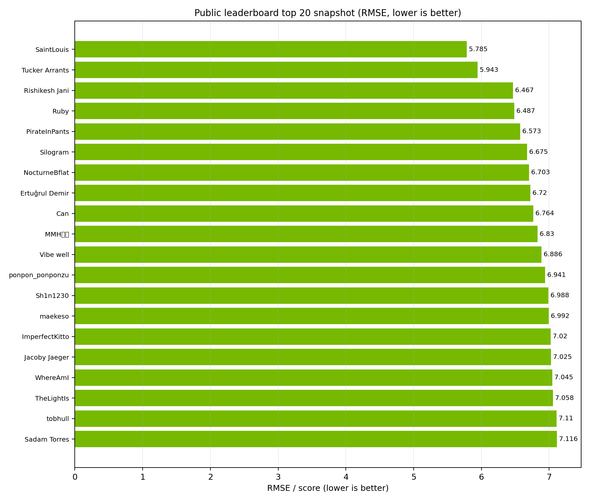
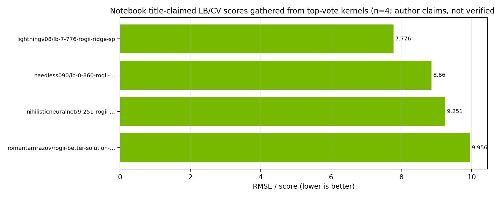
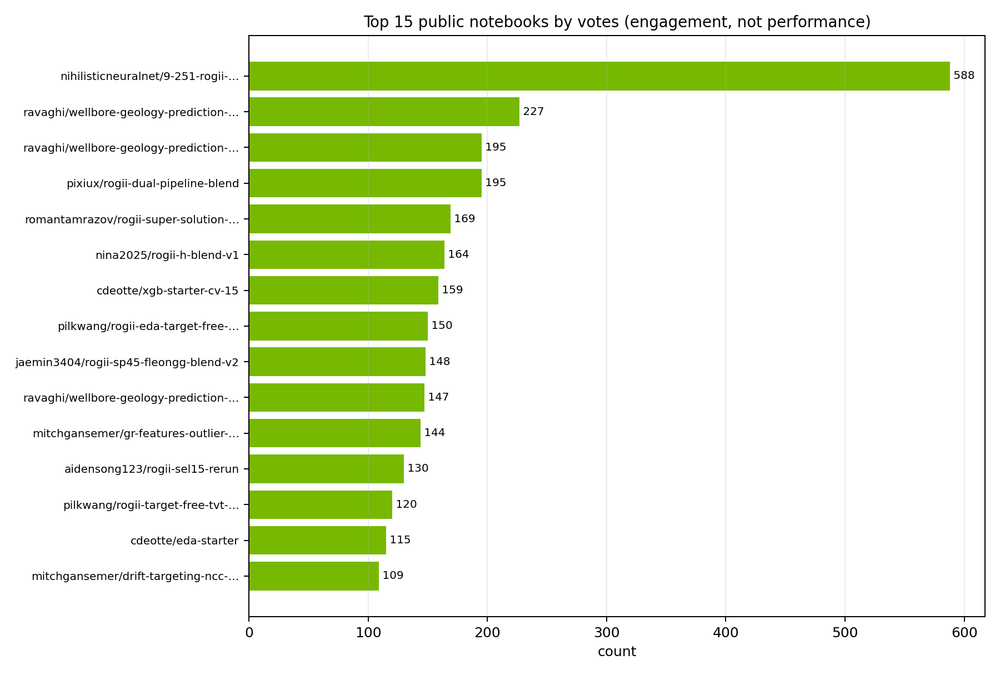
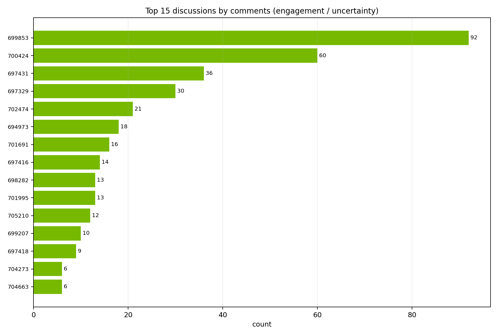

# ROGII Wellbore Geology Prediction — Strategy Brief

Generated: 2026-06-13 UTC  
Competition: [rogii-wellbore-geology-prediction](https://www.kaggle.com/competitions/rogii-wellbore-geology-prediction)

## Executive Takeaways

- This is not a generic tabular regression contest. The target is the hidden continuation of **TVT** along each horizontal well; the useful signal is a mix of last-known trajectory, GR/typewell correlation, spatial structure, and geological constraints.
- Public leaderboard leaders are already around **5.8–7.1 RMSE** in the top page snapshot, while popular starter notebooks sit around **CV 15** or title-claimed **LB 7.776–9.956**. The gap strongly suggests that tree/linear models alone are not enough.
- The strongest public notebook pattern is a **hybrid tracker + model stack**: physics/sequence alignment candidates, spatial KNN/formation-plane priors, boosted regressors, and post-processing/blending.
- Validation is the main risk. Public discussions repeatedly question CV/LB correlation and public-LB trust; use well-grouped validation, simulate hidden suffixes, and report both global RMSE and per-well tail failure modes.
- Submit through Kaggle notebooks only: <=9h CPU/GPU runtime, internet disabled, `submission.csv`, external public data/models allowed under rules.

## Competition Mechanics

- **Task:** predict `tvt` for hidden evaluation intervals of horizontal wells.
- **Metric:** RMSE on row-level `tvt` predictions.
- **Data:** `train/` and `test/` wells, each with horizontal-well CSVs and typewell CSVs; train wells also include PNG visualizations. Dataset description reports **2,327 files, 1.33 GB**.
- **Horizontal features:** `MD`, `X`, `Y`, `Z`, `GR`, `TVT_input`, plus formation surface columns in train (`ANCC`, `ASTNU`, `ASTNL`, `EGFDU`, `EGFDL`, `BUDA`). `TVT_input` is known before the prediction start and `NaN` in the evaluation zone.
- **Typewell features:** vertical reference `TVT`, `GR`, and geology labels used for correlation.
- **Timeline:** start May 5, 2026; entry/team-merger deadline July 29, 2026; final deadline August 5, 2026.

## Score Ladder

| Rung | Evidence gathered this run | Interpretation |
|---|---:|---|
| Public LB top page, best | 5.785 RMSE, SaintLouis, Kaggle CLI leaderboard snapshot 2026-06-13 | Current target for serious medal contention. |
| Public LB top page, 2nd | 5.943 RMSE, Tucker Arrants | Top solutions are sub-6. |
| Public LB top page, 20th | 7.116 RMSE, Sadam Torres | First-page public LB is roughly <=7.1. |
| High-vote public notebook title claim | 7.776 in [`lightningv08/lb-7-776-rogii-ridge-sp`](https://www.kaggle.com/code/lightningv08/lb-7-776-rogii-ridge-sp) | Title-claimed author score, not independently verified by score API. |
| High-vote public notebook title claim | 9.251 in [`nihilisticneuralnet/9-251-rogii-wellbore-geology-prediction-dwt-based`](https://www.kaggle.com/code/nihilisticneuralnet/9-251-rogii-wellbore-geology-prediction-dwt-based) | Title-claimed author score; code uses DWT/DTW, PF/beam, spatial features, GBMs, Ridge stack. |
| Public starter baseline | CV 15 in [`cdeotte/xgb-starter-cv-15`](https://www.kaggle.com/code/cdeotte/xgb-starter-cv-15) and [`cdeotte/nn-starter-cv-15-5`](https://www.kaggle.com/code/cdeotte/nn-starter-cv-15-5) | Useful baseline, not enough for high placement. |

Public kernel score enrichment via the Kaggle SDK was rate-limited with HTTP 429 in this run, so title-embedded notebook scores are labeled as author/title claims rather than verified scores.

## High-Signal Public Notebooks

| Notebook | Why it matters |
|---|---|
| [`nihilisticneuralnet/9-251-rogii-wellbore-geology-prediction-dwt-based`](https://www.kaggle.com/code/nihilisticneuralnet/9-251-rogii-wellbore-geology-prediction-dwt-based) | Large hybrid solution: DWT/DTW-style alignment, particle filter and beam search candidates, spatial KNN/formation-plane features, LightGBM/CatBoost/Ridge stacking, and hill-climbing/post-processing. Treat it as the main public architecture to dissect. |
| [`ravaghi/wellbore-geology-prediction-ridge`](https://www.kaggle.com/code/ravaghi/wellbore-geology-prediction-ridge) | Strong simple model baseline built around engineered features and Ridge; good for a reproducible low-complexity baseline and feature sanity checks. |
| [`ravaghi/wellbore-geology-prediction-hill-climbing`](https://www.kaggle.com/code/ravaghi/wellbore-geology-prediction-hill-climbing) | Demonstrates post-hoc blending/optimization around candidate predictions; useful for learning how public solutions tune blends. |
| [`pixiux/rogii-dual-pipeline-blend`](https://www.kaggle.com/code/pixiux/rogii-dual-pipeline-blend) | Inference/blend pipeline with external artifacts; good reference for packaging complex ensembles into notebook constraints. |
| [`romantamrazov/rogii-super-solution-lb-top-3`](https://www.kaggle.com/code/romantamrazov/rogii-super-solution-lb-top-3) | Public “LB top 3” title claim; useful to compare feature/blend design, but do not assume final rank from votes/title alone. |
| [`pilkwang/rogii-eda-target-free-alignment-for-tvt`](https://www.kaggle.com/code/pilkwang/rogii-eda-target-free-alignment-for-tvt) | EDA around target-free alignment; useful for understanding the inverse problem before model stacking. |
| [`pilkwang/rogii-target-free-tvt-geosteering`](https://www.kaggle.com/code/pilkwang/rogii-target-free-tvt-geosteering) | Geosteering framing and target-free TVT estimation; good conceptual bridge between GR matching and physical priors. |
| [`mitchgansemer/gr-features-outlier-detection-rogii-wellbore`](https://www.kaggle.com/code/mitchgansemer/gr-features-outlier-detection-rogii-wellbore) | Focuses on GR-derived features and outlier detection; helpful for diagnosing failed wells. |
| [`mitchgansemer/drift-targeting-ncc-tree-based-rogii-wellbore`](https://www.kaggle.com/code/mitchgansemer/drift-targeting-ncc-tree-based-rogii-wellbore) | NCC/tree-based drift targeting; good evidence that correlation/alignment features matter. |
| [`kojimar/rogii-inference-stack-with-pf-beam-and-tabicl`](https://www.kaggle.com/code/kojimar/rogii-inference-stack-with-pf-beam-and-tabicl) | Public stack explicitly using particle filters, beam search, and TabICL-style inference; useful for advanced inference candidates. |
| [`sunnywu27/rogii-wellbore-tvt-physical-model`](https://www.kaggle.com/code/sunnywu27/rogii-wellbore-tvt-physical-model) | Physical-model baseline; good for constraints and smoothness priors. |
| [`karnakbaevarthur/physics-informed-baseline`](https://www.kaggle.com/code/karnakbaevarthur/physics-informed-baseline) | Another physics-informed baseline for comparison and ablation. |
| [`yuriygreben/rogii-wellbore-geology-ridge-sp-pipeline`](https://www.kaggle.com/code/yuriygreben/rogii-wellbore-geology-ridge-sp-pipeline) | Ridge + SP pipeline; relevant because a separate public title claims `[LB 7.776] rogii-ridge-sp`. |

## High-Signal Discussions

| Discussion | Signal |
|---|---|
| [Diagram of the problem](https://www.kaggle.com/competitions/rogii-wellbore-geology-prediction/discussion/697418) | Clarifies the geological prediction geometry; good starting point for non-domain competitors. |
| [How Geologists Interpret Wells: Some Helpful Tips](https://www.kaggle.com/competitions/rogii-wellbore-geology-prediction/discussion/698825) | Host/domain guidance: lateral GR before prediction start can correlate better than typewell GR, and lateral GR correlates with itself. This directly supports self-correlation/anchor features. |
| [besides regression, also dwt (time warping)!](https://www.kaggle.com/competitions/rogii-wellbore-geology-prediction/discussion/697431) | Early community push toward dynamic warping / geosteering rather than pure regression. |
| [Paradigm Shift: Why pure Tabular Models might be hitting a wall](https://www.kaggle.com/competitions/rogii-wellbore-geology-prediction/discussion/699289) | Argues for spatial + sequential context: particle/Kalman/beam-style tracking and nearby-well spatial consensus. |
| [stage.1: global search using linear prior tvt = linear(md,z)](https://www.kaggle.com/competitions/rogii-wellbore-geology-prediction/discussion/699326) | Shows global search with a linear `MD/Z` prior and warns that lower GR fit is not necessarily lower TVT error because it is an inverse problem. |
| [multi-trajectory prediction (MTP) with deep CNN for welllog inversion](https://www.kaggle.com/competitions/rogii-wellbore-geology-prediction/discussion/699853) | Advanced sequence modeling discussion; useful if pursuing CNN/trajectory alternatives. |
| [Duplicate type wells for different horizontal wells](https://www.kaggle.com/competitions/rogii-wellbore-geology-prediction/discussion/698449) | Organizer comment says some typewells are pseudo-typewells from nearby interpreted laterals, reinforcing neighbor/pseudo-typewell logic. |
| [Is online learning / test-time fine-tuning allowed?](https://www.kaggle.com/competitions/rogii-wellbore-geology-prediction/discussion/698002) | Important rules/ethics check before adapting on test rows. |
| [Can a single model achieve LB/CV below 10.0?](https://www.kaggle.com/competitions/rogii-wellbore-geology-prediction/discussion/699207) | Community benchmark discussion around sub-10 feasibility. |
| [cv and lb correlations .....](https://www.kaggle.com/competitions/rogii-wellbore-geology-prediction/discussion/701691) and [How much should we trust the LB score?](https://www.kaggle.com/competitions/rogii-wellbore-geology-prediction/discussion/704273) | Validation risk: leaderboard may not reflect private performance; design CV carefully. |
| [Surface columns are in TVD (Z), NOT in TVT](https://www.kaggle.com/competitions/rogii-wellbore-geology-prediction/discussion/701034) | Critical feature-units warning: do not blindly treat formation surfaces as TVT. |
| [Dynamic Programming for TVT Tracking: What Worked, What Didn't](https://www.kaggle.com/competitions/rogii-wellbore-geology-prediction/discussion/702919) | Reports that GR matching can reduce a naive ~55 ft assumption to ~14.3 ft, but sub-10 likely needs spatial structural information. Also warns about raw vs z-scored GR scaling in physical cost functions. |

## What It Takes To Do Well

### 1. Build the right validation harness first

Use a grouped-by-well validation split and simulate the real task by hiding suffix/evaluation intervals from train wells. Track:

- row-level RMSE,
- per-well RMSE distribution,
- tail/worst-well RMSE,
- error versus hidden interval length,
- error versus trajectory shape / Z span / GR shift.

Do not tune only against the public LB. The CV/LB discussions indicate that public score trust is a live concern, and the task has enough per-well heterogeneity that a few bad wells can dominate.

### 2. Start with robust continuation baselines

Minimum baseline features should include:

- last known `TVT_input`, known-mask position, distance since prediction start,
- recent and global slopes of `TVT_input` versus `MD` and `Z`,
- smoothed `GR`, deltas, rolling stats, and correlation summaries,
- typewell interpolation of `GR` at candidate TVT positions,
- simple physical constraints: smoothness, monotonicity/step size bounds, and no wild branch switches.

Study the Ridge and XGB/NN starters for a clean baseline: [`ravaghi/wellbore-geology-prediction-ridge`](https://www.kaggle.com/code/ravaghi/wellbore-geology-prediction-ridge), [`cdeotte/xgb-starter-cv-15`](https://www.kaggle.com/code/cdeotte/xgb-starter-cv-15), and [`cdeotte/nn-starter-cv-15-5`](https://www.kaggle.com/code/cdeotte/nn-starter-cv-15-5).

### 3. Add GR/typewell alignment candidates

The target is a stratigraphic position, not just a coordinate. Public evidence points to alignment as a major lift:

- dynamic time warping / dynamic programming over horizontal GR and typewell GR,
- multi-scale normalized cross-correlation windows,
- beam search or Viterbi-style paths with smoothness and velocity penalties,
- particle filters that combine trajectory priors with GR observations,
- multiple candidate paths instead of a single brittle path.

Use raw GR units for physical observation costs when appropriate; the dynamic-programming discussion warns that z-scoring GR can make movement penalties dominate and freeze the path.

### 4. Add spatial and pseudo-typewell structure

Sub-10 appears to require an independent spatial channel, not just a better decoder. Recommended features:

- nearest-neighbor wells by `X/Y`, with distance-aware medians/quantiles of known TVT or formation offsets,
- formation-plane / surface interpolation features using cKDTree or local plane fits,
- pseudo-typewell candidates from nearby interpreted laterals,
- dense spatial imputation of formation markers and offsets,
- difference features between physical/alignment predictions and spatial predictions.

This is supported by the pseudo-typewell organizer comment in [Duplicate type wells](https://www.kaggle.com/competitions/rogii-wellbore-geology-prediction/discussion/698449), the spatial/sequential discussion [699289](https://www.kaggle.com/competitions/rogii-wellbore-geology-prediction/discussion/699289), and the public hybrid notebooks using `cKDTree` / spatial features.

### 5. Stack diverse candidate predictions

A strong practical architecture:

1. Generate candidate TVT paths: slope continuation, typewell interpolation, DTW/NCC path, beam path, PF path, spatial KNN path, formation-plane path.
2. Build row-level features from candidate values, candidate disagreements, uncertainty proxies, GR mismatch costs, distances, and hidden-position context.
3. Train well-grouped LightGBM/CatBoost/XGBoost/Ridge models on residuals or direct target.
4. Blend OOF predictions with constrained Ridge / nonnegative weights.
5. Apply per-well smoothness post-processing and hill-climbing only if it improves grouped CV and does not create implausible path jumps.

The public DWT-based and dual-pipeline notebooks show this style; the hill-climbing notebook is worth studying for final blend optimization.

## Implementation Roadmap

**Day 1–2: Reproducible baseline**

- Recreate a grouped suffix-holdout CV.
- Reproduce a Ridge/XGB starter and confirm CV around the public starter range.
- Add dashboards for per-well error, hidden interval length, and path plots.

**Day 3–5: Alignment candidates**

- Implement typewell GR interpolation and NCC windows.
- Add constrained DTW / beam candidates with smoothness penalties.
- Add candidate-cost and candidate-disagreement features.
- Compare candidate-only RMSE before training a stack.

**Day 6–8: Spatial channel**

- Build cKDTree nearest-neighbor features by well and row coordinate.
- Fit local formation-plane/offset priors; respect the TVD-vs-TVT warning for surface columns.
- Add pseudo-typewell candidate features from nearby laterals.
- Validate whether spatial features reduce the worst-well tail, not just mean RMSE.

**Day 9–12: Ensemble and packaging**

- Train LightGBM/CatBoost/Ridge residual stack with GroupKFold by well.
- Blend candidate paths + model predictions with OOF-constrained weights.
- Add smoothness post-processing; hill-climb only within physically plausible constraints.
- Package artifacts into an internet-off Kaggle notebook under the 9-hour runtime limit.

## Pitfalls

- **Popularity is not performance:** votes identify useful notebooks but do not establish leaderboard rank.
- **Title scores are not verified scores:** this brief labels title-embedded scores as claims unless the leaderboard or score API confirmed them.
- **Avoid leakage:** train-only formation surface columns may not exist in real test as usable columns; only rely on features available in the committed notebook’s true test environment.
- **Respect units:** discussion [701034](https://www.kaggle.com/competitions/rogii-wellbore-geology-prediction/discussion/701034) says surface columns are TVD/Z, not TVT.
- **Do not overfit public LB:** the private split may punish brittle path selectors and over-tuned blend weights.
- **Watch inference runtime:** PF/beam/DTW over ~200 test wells can be expensive; cache per-well features and JIT/vectorize critical loops.

## Evidence And Artifacts

- Competition overview fetched to `competition_overview_raw.md`.
- Dataset description fetched to `dataset_description_raw.md`.
- Kernel metadata fetched to `kernels_query.json`.
- Discussion metadata/comments fetched to `discussions_query.json` and `discussion_*.md` files.
- Leaderboard snapshot fetched to `leaderboard.csv`.
- Plot sidecars and render scripts are under `plots/`; each PNG is rendered from the matching JSON file.
