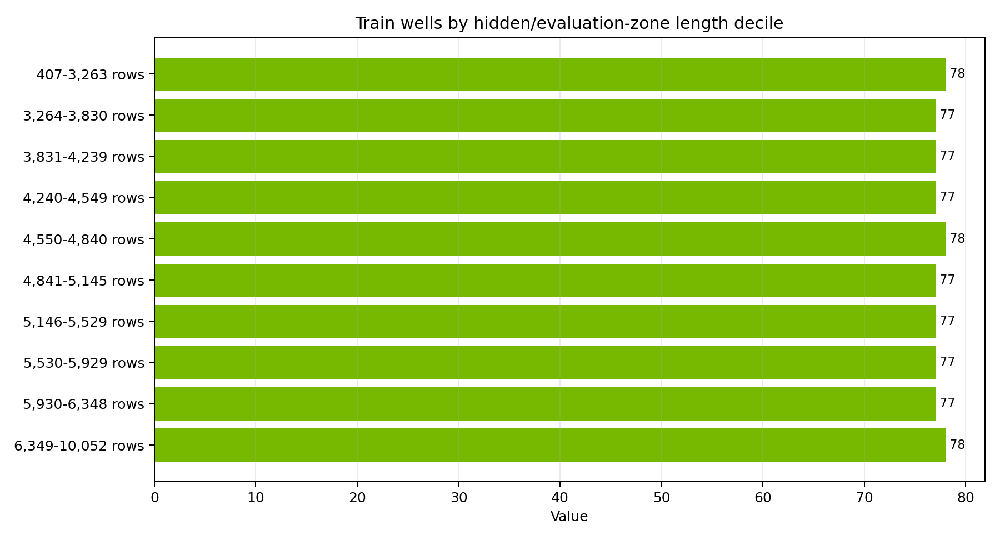
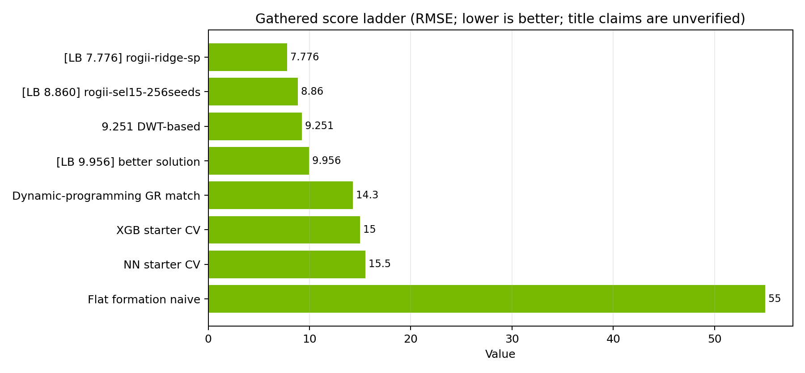
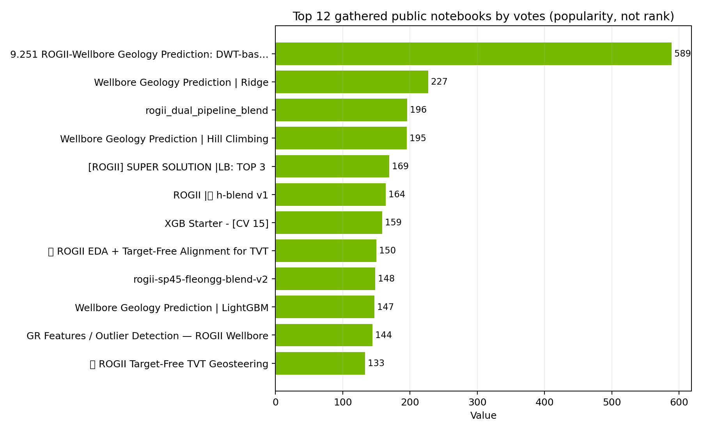

# ROGII Wellbore Geology Prediction — Strategy Brief

Research snapshot: 2026-06-13 UTC, using the `nvidia-kaggle-skill` competition overview, dataset, kernel, and discussion workflows. Competition page: [ROGII - Wellbore Geology Prediction](https://www.kaggle.com/competitions/rogii-wellbore-geology-prediction).

## Executive read

This is not a normal tabular regression contest. The target is `TVT`, the geologic position of each hidden evaluation row along a horizontal well. The data gives each well's horizontal trajectory and GR log, plus a matching vertical typewell GR log indexed by TVT. The winning shape is therefore a geosteering / sequence-alignment problem: infer a smooth TVT path that honors known `TVT_input`, local GR-to-typewell correlation, formation surfaces, and spatial structure from neighboring wells.

To do well, build a hybrid system: a strong structural prior from surfaces and neighboring wells, a local GR/typewell tracker, and a cautious ensemble/selector. Pure XGBoost or neural tabular starters sit around the mid-teens CV by public notebook claims; public notebooks with ridge/SP, beam search, particle filters, TabICL/artifact stacks, and blends claim single-digit LB values. Public score enrichment was rate-limited in this run, so notebook-title LB/CV numbers below are explicitly labeled as title claims, not independently verified leaderboard reads.

## Competition mechanics that matter

- **Task:** predict `tvt` for every hidden evaluation point in each horizontal well.
- **Metric:** RMSE, lower is better.
- **Submission:** `submission.csv` with `id,tvt`, where IDs look like `{WELLNAME}_{row_index}`.
- **Code competition:** submit through Kaggle Notebooks; CPU or GPU runtime must be <= 9 hours, internet disabled, output file must be named `submission.csv`.
- **External data:** freely and publicly available external data and pretrained models are allowed under the competition rules.
- **Timeline:** started May 5, 2026; entry/team merger deadline July 29, 2026; final submissions due August 5, 2026.
- **Local data cache in this run:** 773 train wells, 773 train typewells, 3 public example test wells, and a 14,151-row sample submission. Hidden reruns replace the visible example test folder with about 200 evaluation wells.

## Data model

Each train well has:

- `{WELLNAME}__horizontal_well.csv`: `MD`, `X`, `Y`, `Z`, six formation-surface columns (`ANCC`, `ASTNU`, `ASTNL`, `EGFDU`, `EGFDL`, `BUDA`), `GR`, target `TVT`, and `TVT_input` with NaNs in the evaluation zone.
- `{WELLNAME}__typewell.csv`: vertical reference `TVT`, `GR`, and categorical `Geology`.
- `{WELLNAME}.png`: visual cross-section.

The important interpretation is that typewell TVT is a vertical stratigraphic coordinate, while the horizontal well is a path through the formation. Good predictions act like a geologist correlating the horizontal GR trace to the typewell GR trace while respecting well geometry and regional structure.

Takeaway: evaluation zones are long, often thousands of rows, so errors accumulate unless the path tracker stays globally anchored.

## Score ladder gathered this run

Public leaderboard score lookup via `fetch_top_kernel_scores.py` hit Kaggle API 429 rate limits, so the ladder uses only values gathered from notebook titles and discussion text. Treat title-embedded LB/CV values as author claims until you verify them on Kaggle.

Takeaway: the public evidence separates into three bands: naive geometry around 55 RMSE, simple ML around 15 RMSE, and public alignment/spatial/blend notebooks claiming roughly 7.8–10 RMSE.

| Rung | Gathered value | Evidence | Interpretation |
|---|---:|---|---|
| Naive flat-formation assumption | 55.0 RMSE | [Dynamic Programming for TVT Tracking](https://www.kaggle.com/competitions/rogii-wellbore-geology-prediction/discussion/702919) | Too weak; TVT and Z increments correlate, but scale/drift are wrong. |
| Local GR matching / DP | 14.3 RMSE | [Dynamic Programming for TVT Tracking](https://www.kaggle.com/competitions/rogii-wellbore-geology-prediction/discussion/702919) | Local matcher helps, but does not close the gap to single digits alone. |
| XGB starter | title claims CV 15 | [XGB Starter - CV 15](https://www.kaggle.com/code/cdeotte/xgb-starter-cv-15) | Solid baseline with grouped validation and residual learning. |
| NN starter | title claims CV 15.5 | [NN Starter - CV 15.5](https://www.kaggle.com/code/cdeotte/nn-starter-cv-15-5) | Neural tabular baseline; not enough alone. |
| DWT-based alignment | title claims 9.251 | [9.251 ROGII DWT-based](https://www.kaggle.com/code/nihilisticneuralnet/9-251-rogii-wellbore-geology-prediction-dwt-based) | Signal-alignment approach is competitive. |
| Better solution | title claims LB 9.956 | [[ROGII] BETTER SOLUTION](https://www.kaggle.com/code/romantamrazov/rogii-better-solution-lb-9-956) | Beam/PF/NCC family beats starters. |
| SEL15 256 seeds | title claims LB 8.860 | [[LB 8.860] rogii-sel15-256seeds](https://www.kaggle.com/code/needless090/lb-8-860-rogii-sel15-256seeds) | Heavy seed/selector ensembling can improve LB. |
| Ridge SP | title claims LB 7.776 | [[LB 7.776] rogii-ridge-sp](https://www.kaggle.com/code/lightningv08/lb-7-776-rogii-ridge-sp) | Best title-claimed public rung gathered here; verify before relying on it. |

## Key public notebooks to study

The table below is ordered for learning value, not by votes or confirmed performance.

| Notebook | What to extract | Why it matters |
|---|---|---|
| [EDA Starter](https://www.kaggle.com/code/cdeotte/eda-starter) | Data loading, well-level visualization, TVT/GR intuition | Fast orientation before modeling. |
| [XGB Starter - CV 15](https://www.kaggle.com/code/cdeotte/xgb-starter-cv-15) | GroupKFold by well, residual over last-known `TVT_input`, typewell GR features | Baseline validation and leakage discipline. |
| [ROGII EDA + Target-Free Alignment for TVT](https://www.kaggle.com/code/pilkwang/rogii-eda-target-free-alignment-for-tvt) | Target-free alignment framing and GR/typewell correlation | Shows why this is an alignment task. |
| [ROGII Target-Free TVT Geosteering](https://www.kaggle.com/code/pilkwang/rogii-target-free-tvt-geosteering) | Geosteering-style path estimation | Bridges domain interpretation and inference. |
| [GR Features / Outlier Detection](https://www.kaggle.com/code/mitchgansemer/gr-features-outlier-detection-rogii-wellbore) | GR feature engineering and anomaly handling | GR quality varies; robust preprocessing matters. |
| [Drift Targeting + NCC](https://www.kaggle.com/code/mitchgansemer/drift-targeting-ncc-tree-based-rogii-wellbore) | Normalized cross-correlation and drift targeting | Practical local matcher. |
| [ROGII DWT-based](https://www.kaggle.com/code/nihilisticneuralnet/9-251-rogii-wellbore-geology-prediction-dwt-based) | Dynamic/time warping ideas | Directly attacks sequence alignment. |
| [Wellbore Geology Prediction - Ridge](https://www.kaggle.com/code/ravaghi/wellbore-geology-prediction-ridge) | Ridge stack, particle filter, beam variants, selector thresholds | Strong public ensemble template. |
| [Wellbore Geology Prediction - LightGBM](https://www.kaggle.com/code/ravaghi/wellbore-geology-prediction-lightgbm) | Tree model counterpart to ridge stack | Useful feature/model comparison. |
| [Wellbore Geology Prediction - Hill Climbing](https://www.kaggle.com/code/ravaghi/wellbore-geology-prediction-hill-climbing) | Blend weight search | Helps turn many correlated signals into a final prediction. |
| [ROGII dual pipeline blend](https://www.kaggle.com/code/pixiux/rogii-dual-pipeline-blend) | Multi-pipeline blending | Study for ensembling and failover logic. |
| [[ROGII] SUPER SOLUTION - LB TOP 3](https://www.kaggle.com/code/romantamrazov/rogii-super-solution-lb-top-3) | Numba beam search, multi-scale NCC, per-formation RMSE trust, ridge stack | High-signal implementation pattern. |
| [[LB 7.776] rogii-ridge-sp](https://www.kaggle.com/code/lightningv08/lb-7-776-rogii-ridge-sp) | Ridge/SP, beam/PF/LightGBM lineage | Best title-claimed public score gathered here. |
| [ROGII Inference Stack with PF, Beam and TabICL](https://www.kaggle.com/code/kojimar/rogii-inference-stack-with-pf-beam-and-tabicl) | Artifact-backed LightGBM/CatBoost/TabICL stack, PF and beam features | Shows the public meta-stack direction. |
| [AeroRidge Engine v2](https://www.kaggle.com/code/svanikkolli/aeroridge-engine-v2) | Ridge/engine lineage used by later stacks | Important ancestor for inference-stack notebooks. |
| [ROGII h-blend v1](https://www.kaggle.com/code/nina2025/rogii-h-blend-v1) and [h-blend v2](https://www.kaggle.com/code/nina2025/rogii-h-blend-v2) | Blend ingredients used by later notebooks | Useful for lineage and public blend components. |
| [SP45 + Fleongg EDA](https://www.kaggle.com/code/iaztec/rogii-wellbore-geology-sp45-fleongg-eda) and [fle3n ROGII v4](https://www.kaggle.com/code/fleongg/fle3n-rogii-v4) | SP45/Fleongg family signals | Public lineage references in blends/selectors. |

Takeaway: popularity clusters around DWT/alignment, ridge/blend stacks, and geosteering notebooks, but votes are not performance; use the chart only as a discovery map.

## Key discussions to read

- [Diagram of the problem](https://www.kaggle.com/competitions/rogii-wellbore-geology-prediction/discussion/697418): visual mental model of horizontal well vs typewell.
- [How Geologists Interpret Wells: Some Helpful Tips](https://www.kaggle.com/competitions/rogii-wellbore-geology-prediction/discussion/698825): organizer/domain guidance; start here for interpretation habits.
- [Share a UI visualizer](https://www.kaggle.com/competitions/rogii-wellbore-geology-prediction/discussion/700424): includes a viewer repo and a useful “TVT as floor number” analogy.
- [Besides regression, also DWT / time warping](https://www.kaggle.com/competitions/rogii-wellbore-geology-prediction/discussion/699853): frames the problem as multi-trajectory / signal matching rather than pointwise regression.
- [A geophysicist's take: domain priors + Q-3D tortuosity](https://www.kaggle.com/competitions/rogii-wellbore-geology-prediction/discussion/702131): argues for domain priors and geophysical structure.
- [Dynamic Programming for TVT Tracking](https://www.kaggle.com/competitions/rogii-wellbore-geology-prediction/discussion/702919): high-value post quantifying naive `TVT=-Z+C` at about 55 RMSE, GR matching at about 14.3 RMSE, and the need for spatial structure to reach sub-10.
- [Surface columns are in TVD/Z, not TVT](https://www.kaggle.com/competitions/rogii-wellbore-geology-prediction/discussion/702018): critical feature-semantics warning; do not treat formation columns as TVT.
- [Duplicate type wells for different horizontal wells](https://www.kaggle.com/competitions/rogii-wellbore-geology-prediction/discussion/700809): relevant for grouping, leakage, and spatial/typewell reuse.
- [Definition of TVT](https://www.kaggle.com/competitions/rogii-wellbore-geology-prediction/discussion/701086): clarifies target semantics.
- [How much should we trust the LB score?](https://www.kaggle.com/competitions/rogii-wellbore-geology-prediction/discussion/701511), [CV and LB correlations](https://www.kaggle.com/competitions/rogii-wellbore-geology-prediction/discussion/701468), and [Private Test Update and Rescore](https://www.kaggle.com/competitions/rogii-wellbore-geology-prediction/discussion/701202): read before overfitting public LB.
- [Submission Scoring Error — Is the scorer live yet?](https://www.kaggle.com/competitions/rogii-wellbore-geology-prediction/discussion/697329): early scorer issue was reported and fixed; useful for submission debugging history.

## What strong solutions seem to have in common

### 1. Leakage-safe validation

Use well-grouped validation, not random row splits. The [XGB starter](https://www.kaggle.com/code/cdeotte/xgb-starter-cv-15) explicitly uses GroupKFold so rows from the same well do not leak across folds. For local validation, mask the same `TVT_input` region pattern the competition uses, validate entire held-out wells, and track error by well length, formation, GR missingness, and surface geometry.

### 2. A last-known TVT baseline and residual framing

The starter approach treats the last known `TVT_input` as a strong anchor and learns residuals. This is a good sanity baseline because a zero residual is interpretable and usually hard to beat with a naive model. But long evaluation zones drift, so residual models need geometry and alignment signals, not just rowwise features.

### 3. GR-to-typewell local matchers

Public work repeatedly uses the typewell GR trace as an alignment target: DWT/time warping, normalized cross-correlation, Viterbi/beam search, and particle filters. Study [DWT-based](https://www.kaggle.com/code/nihilisticneuralnet/9-251-rogii-wellbore-geology-prediction-dwt-based), [Drift Targeting + NCC](https://www.kaggle.com/code/mitchgansemer/drift-targeting-ncc-tree-based-rogii-wellbore), [SUPER SOLUTION](https://www.kaggle.com/code/romantamrazov/rogii-super-solution-lb-top-3), and [Inference Stack with PF, Beam and TabICL](https://www.kaggle.com/code/kojimar/rogii-inference-stack-with-pf-beam-and-tabicl). The caution from the dynamic-programming discussion is important: raw GR scaling can matter in physics-style cost functions; z-scoring may shrink observation costs so much that the path never moves.

### 4. Spatial structural priors

The strongest public direction is not only “better GR matching.” The [dynamic-programming discussion](https://www.kaggle.com/competitions/rogii-wellbore-geology-prediction/discussion/702919) argues that GR matching gets from roughly 55 to 14.3 RMSE, while the remaining single-digit gap requires neighboring-well spatial structure. Public notebooks mention formation planes, dense ANCC imputation, KD-trees, and spatial-pooling/SP features; study [Ridge](https://www.kaggle.com/code/ravaghi/wellbore-geology-prediction-ridge), [[LB 7.776] ridge-sp](https://www.kaggle.com/code/lightningv08/lb-7-776-rogii-ridge-sp), and [Inference Stack](https://www.kaggle.com/code/kojimar/rogii-inference-stack-with-pf-beam-and-tabicl).

### 5. Model stacks and selectors

The public stack pattern is to generate many path candidates/features, then use Ridge/LightGBM/CatBoost/TabICL artifacts and blend/selectors. The [SUPER SOLUTION](https://www.kaggle.com/code/romantamrazov/rogii-super-solution-lb-top-3) lists beam configs, multi-scale NCC, per-formation known-zone RMSE, GR envelope/energy, and a positive ridge stack. The [Ridge](https://www.kaggle.com/code/ravaghi/wellbore-geology-prediction-ridge) notebook includes selector thresholds by evaluation length and Z span, plus particle-filter ensembles. The [Hill Climbing](https://www.kaggle.com/code/ravaghi/wellbore-geology-prediction-hill-climbing) notebook is the natural follow-up for blend optimization.

## Recommended implementation path

1. **Reproduce a baseline:** run [EDA Starter](https://www.kaggle.com/code/cdeotte/eda-starter) and [XGB Starter - CV 15](https://www.kaggle.com/code/cdeotte/xgb-starter-cv-15). Keep GroupKFold by well and a simple last-known TVT residual target.
2. **Build an evaluation harness:** create held-out-well folds and a mask that mimics `TVT_input` NaNs. Report overall RMSE, per-well RMSE, long-zone RMSE, formation-zone RMSE, and GR-missingness slices.
3. **Add typewell alignment features:** implement NCC windows, DWT/DTW, Viterbi/beam search, and particle-filter candidate TVT paths. Use [DWT-based](https://www.kaggle.com/code/nihilisticneuralnet/9-251-rogii-wellbore-geology-prediction-dwt-based), [Drift Targeting + NCC](https://www.kaggle.com/code/mitchgansemer/drift-targeting-ncc-tree-based-rogii-wellbore), and [SUPER SOLUTION](https://www.kaggle.com/code/romantamrazov/rogii-super-solution-lb-top-3) as references.
4. **Add structural features:** fit formation-surface and neighboring-well priors from train wells. Include distance-weighted/KD-tree features, formation plane residuals, surface-to-trajectory deltas, and dense ANCC-style imputations. Cross-check the [surface column warning](https://www.kaggle.com/competitions/rogii-wellbore-geology-prediction/discussion/702018) so you keep TVD/Z and TVT semantics separate.
5. **Train candidate models:** start with Ridge and LightGBM on interpretable candidate signals; add CatBoost/TabICL only after CV is stable. Use positive Ridge stacking and per-well selectors before attempting complex neural models.
6. **Blend conservatively:** use hill climbing or constrained linear stacking, but inspect per-well failures. Weight local matcher vs spatial prior by evaluation length, Z span, known-zone fit, GR quality, and formation-surface consistency.
7. **Submission hardening:** verify `submission.csv` row order, no NaNs, all IDs, and notebook runtime without internet. Keep public LB submissions sparse because the hidden test replacement can punish LB-specific selectors.

## Risks and traps

- **Public-LB overfitting:** the visible test set is small/example-like, and discussions question LB trust. Prefer stable grouped CV and per-slice diagnostics.
- **Feature semantics:** formation columns are predicted depths in TVD/Z space, not target TVT. Incorrectly mixing these coordinates can produce plausible but wrong features.
- **GR preprocessing:** normalized GR is useful for NCC features, but physics/path-cost decoders may need raw API-scale GR so movement and observation costs are comparable.
- **Duplicate or reused typewells:** typewell reuse can create leakage-like shortcuts if validation groups only by horizontal well. Track typewell IDs/signatures and test groupings by typewell family if possible.
- **Artifact dependency:** many strong public notebooks are inference stacks over public Kaggle datasets/artifacts. If you use them, make sure every artifact is public, attached as an input dataset, and available with internet disabled.

## Plot provenance

All plots are generated from JSON sidecars in `plots/`:

- `plots/score_ladder.json` → `plots/score_ladder.png`: gathered title-claimed scores and discussion-stated RMSE values.
- `plots/top_notebook_votes.json` → `plots/top_notebook_votes.png`: top 12 notebooks by gathered vote count from `kernel_query`.
- `plots/eval_zone_length_deciles.json` → `plots/eval_zone_length_deciles.png`: derived from local competition train CSVs fetched for this run.

