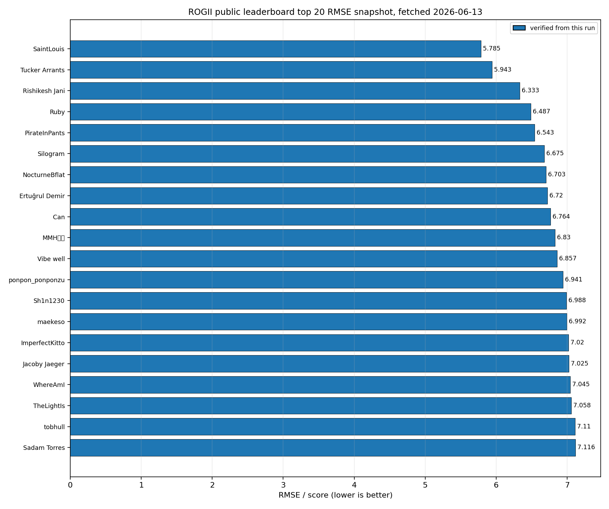
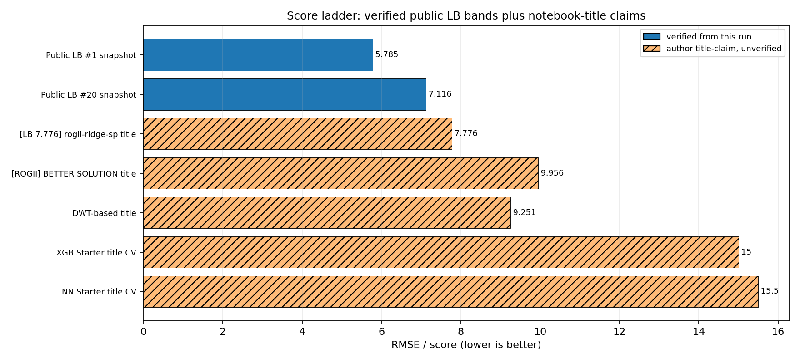
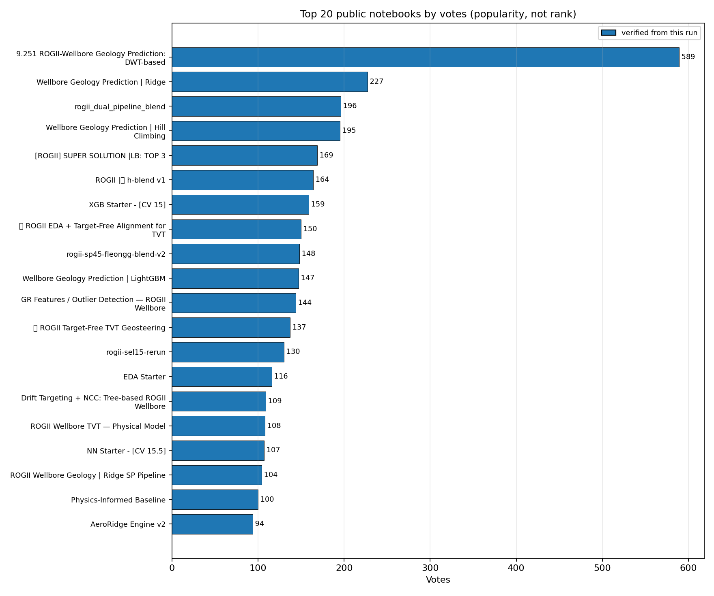
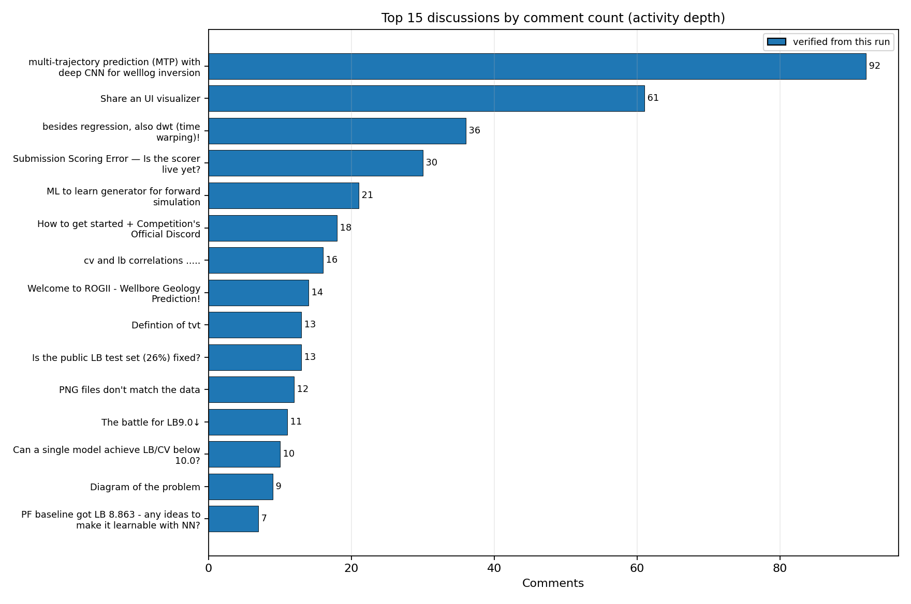

# ROGII Wellbore Geology Prediction — Strategy Brief

Research run: 2026-06-13 UTC  
Competition: [rogii-wellbore-geology-prediction](https://www.kaggle.com/competitions/rogii-wellbore-geology-prediction)  
Output artifacts: plots in [`plots/`](plots/), raw skill outputs in [`raw/`](raw/)

## Executive takeaways

- This is not a plain tabular regression contest. The best public ideas treat TVT as a **continuous stratigraphic coordinate** constrained by trajectory geometry, the known `TVT_input` prefix, formation surfaces, and alignment of horizontal-well `GR` against typewell `GR`.
- The public leaderboard had already reached **5.785 RMSE** at rank 1 in the Kaggle CLI snapshot fetched on 2026-06-13; rank 20 was **7.116 RMSE**. That means title-claimed public notebooks around 7.8–10 are useful baselines, not the current frontier.
- Strong public notebooks cluster around four motifs: **Ridge/GBM residual models**, **surface/physics post-processing**, **GR/typewell alignment via NCC/DTW/beam/particle filters**, and **blends/hill climbing**.
- The most important validation risk is distribution shift / public LB overfit. Use grouped-by-well OOF, hold out whole wells, track known-zone sanity checks, and validate against shuffled/zero-GR controls before trusting signal-matching features.
- No final solution writeups were found by the leaderboard-writeup scraper in this run, which is expected for an active competition.

## Mechanics that matter

- **Target:** predict `tvt` for each hidden row in the evaluation zone of each horizontal well.
- **Metric:** official competition page says submissions are scored by root mean squared error; lower is better.
- **Submission:** notebook-only code competition; `submission.csv` must contain `id,tvt` rows.
- **Runtime constraints:** CPU or GPU Notebook <= 9 hours, internet disabled, public external data and pretrained models allowed.
- **Data:** each training well has a horizontal-well CSV, typewell CSV, and PNG. Horizontal data includes `MD`, `X`, `Y`, `Z`, `GR`, `TVT_input`, formation surfaces (`ANCC`, `ASTNU`, `ASTNL`, `EGFDU`, `EGFDL`, `BUDA`) and training `TVT`. Typewells provide vertical `TVT`, `GR`, and `Geology` labels.
- **Hidden test:** visible test files are examples; the real rerun test has about 200 wells.

## Score ladder

Use this as a planning ladder, not as a promise of private-LB performance. Verified rows come from this run's `kaggle competitions leaderboard ... --show -v` snapshot. Title-claim rows are parsed from notebook titles gathered in this run and are **not verified scores**.

| Rung | Score | Provenance | Source |
|---|---:|---|---|
| Public LB rank 1 snapshot | 5.785 | verified | team `SaintLouis`, leaderboard snapshot fetched 2026-06-13 |
| Public LB rank 20 snapshot | 7.116 | verified | team `Sadam Torres`, leaderboard snapshot fetched 2026-06-13 |
| Ridge SP public notebook | 7.776 | title-claim | [[LB 7.776]rogii-ridge-sp](https://www.kaggle.com/code/lightningv08/lb-7-776-rogii-ridge-sp) |
| SEL15 public notebook | 8.860 | title-claim | [【LB 8.860】rogii-sel15-256seeds](https://www.kaggle.com/code/needless090/lb-8-860-rogii-sel15-256seeds) |
| DWT-based public notebook | 9.251 | title-claim | [9.251 ROGII-Wellbore Geology Prediction: DWT-based](https://www.kaggle.com/code/nihilisticneuralnet/9-251-rogii-wellbore-geology-prediction-dwt-based) |
| Better Solution notebook | 9.956 | title-claim | [[ROGII] BETTER SOLUTION \| LB: 9.956](https://www.kaggle.com/code/romantamrazov/rogii-better-solution-lb-9-956) |
| XGB starter | 15.0 | title-claim CV | [XGB Starter - [CV 15]](https://www.kaggle.com/code/cdeotte/xgb-starter-cv-15) |
| NN starter | 15.5 | title-claim CV | [NN Starter - [CV 15.5]](https://www.kaggle.com/code/cdeotte/nn-starter-cv-15-5) |

## Key public notebooks to study

Popularity is not rank, but the public notebook graph shows what the community is building on.

| Notebook | Why it matters |
|---|---|
| [9.251 ROGII-Wellbore Geology Prediction: DWT-based](https://www.kaggle.com/code/nihilisticneuralnet/9-251-rogii-wellbore-geology-prediction-dwt-based) | Pull succeeded. Hybrid of GroupKFold training, Ridge/CatBoost/LightGBM, DTW/beam/particle-filter alignment features, hill climbing, and post-processing. Good template for signal-alignment + ensemble plumbing. |
| [Wellbore Geology Prediction \| Ridge](https://www.kaggle.com/code/ravaghi/wellbore-geology-prediction-ridge) | Pull succeeded. Strong public baseline pattern: feature engineering around known TVT/GR/surfaces, multiple LightGBM/CatBoost models, Ridge ensembling, post-processing, GroupKFold. |
| [rogii_dual_pipeline_blend](https://www.kaggle.com/code/pixiux/rogii-dual-pipeline-blend) | Pull succeeded. Explicit dual pipeline: `ridge-sp45` plus `fleongg` likelihood-PF/GBM stack, final 0.55/0.45 blend, and guarded physical override. Very useful for blending architecture. |
| [Wellbore Geology Prediction \| Hill Climbing](https://www.kaggle.com/code/ravaghi/wellbore-geology-prediction-hill-climbing) | Pull succeeded. Shows model-output blending/optimization and post-processing on top of the Ridge-style pipeline. |
| [[ROGII] SUPER SOLUTION \|LB: TOP 3](https://www.kaggle.com/code/romantamrazov/rogii-super-solution-lb-top-3) | Pull succeeded. Tuned LGB+CB residual stack with formation known-zone RMSE features, dense/reference matching, NCC-style scores, and post-processing. Title claims top-3 LB but exact score was not verified. |
| [ROGII \| h-blend v1](https://www.kaggle.com/code/nina2025/rogii-h-blend-v1) | High-vote blend notebook. Use as lineage/evidence for public ensemble mixing; pull not attempted in this run. |
| [ROGII EDA + Target-Free Alignment for TVT](https://www.kaggle.com/code/pilkwang/rogii-eda-target-free-alignment-for-tvt) | High-vote alignment/EDA notebook. Study for target-free inference-time constraints and visualization ideas. |
| [Drift Targeting + NCC: Tree-based ROGII Wellbore](https://www.kaggle.com/code/mitchgansemer/drift-targeting-ncc-tree-based-rogii-wellbore) | High-vote notebook focused on drift targeting and normalized cross-correlation features. |
| [ROGII Wellbore TVT — Physical Model](https://www.kaggle.com/code/sunnywu27/rogii-wellbore-tvt-physical-model) | Physical/geometric prior baseline; useful for guardrails and post-processing. |
| [Physics-Informed Baseline](https://www.kaggle.com/code/karnakbaevarthur/physics-informed-baseline) | Another physics-first reference; useful to compare against pure GBM residual models. |

Notebook pulls that returned 403 in this run, but are still important metadata links: [Quick EDA: Visualizing targets and wells](https://www.kaggle.com/code/chokkan/quick-eda-visualizing-targets-and-wells), [TVT Prediction Baseline](https://www.kaggle.com/code/coppermind/tvt-prediction-baseline), and [Explained EDA Guide: Wellbore Geo Prediction](https://www.kaggle.com/code/luv4tech/explained-eda-guide-wellbore-geo-prediction).

## Key discussions and what they imply

| Discussion | Signal for strategy |
|---|---|
| [Diagram of the problem](https://www.kaggle.com/competitions/rogii-wellbore-geology-prediction/discussion/697418) | Most-voted conceptual framing. Treat TVT as a stratigraphic/geological position, not merely measured depth or vertical depth. The comments highlight confusion around TVT conventions, which is itself a modeling risk. |
| [How Geologists Interpret Wells: Some Helpful Tips](https://www.kaggle.com/competitions/rogii-wellbore-geology-prediction/discussion/698825) | Organizer/geologist guidance. The useful takeaway is to emulate geological correlation: use typewell signatures, horizons, and continuity rather than only row-wise tabular prediction. |
| [multi-trajectory prediction (MTP) with deep CNN for welllog inversion](https://www.kaggle.com/competitions/rogii-wellbore-geology-prediction/discussion/699853) | Highest-comment technical thread. Contains concrete community experiments around GR/template alignment, offsets, trajectory bands, `dtvt` vs `-dz`, and sanity checks. Notable reported examples include oracle bands improving ~9.99→~8.76 on covered rows, chunk-DP ~9.47→~9.24, template midpoint around ~8.5, and discrete-offset cumsum around ~7.7; treat these as discussion-reported experiments, not verified LB. |
| [besides regression, also dwt (time warping)!](https://www.kaggle.com/competitions/rogii-wellbore-geology-prediction/discussion/697431) | Early signal that dynamic time warping / curve matching is central. This aligns with the DWT notebook and NCC/drift notebooks. |
| [Paradigm Shift: Why pure Tabular Models might be hitting a wall](https://www.kaggle.com/competitions/rogii-wellbore-geology-prediction/discussion/699289) | Community warning that row-wise tabular models need spatial/sequential context. |
| [Duplicate type wells for different horizontal wells](https://www.kaggle.com/competitions/rogii-wellbore-geology-prediction/discussion/698449) | Typewell duplication can be signal or leakage-adjacent structure; group-aware validation must prevent over-crediting duplicated references. |
| [Is online learning / test-time fine-tuning allowed?](https://www.kaggle.com/competitions/rogii-wellbore-geology-prediction/discussion/698002) | Clarify any test-time adaptation against competition rules before using it. Notebook reruns see hidden test inputs, but internet is disabled and rule compliance matters. |
| [cv and lb correlations .....](https://www.kaggle.com/competitions/rogii-wellbore-geology-prediction/discussion/701691) and [How much should we trust the LB score?](https://www.kaggle.com/competitions/rogii-wellbore-geology-prediction/discussion/704273) | Public LB may not track local CV cleanly. Use multiple validation slices and avoid tuning directly to public LB. |
| [Surface columns (ANCC, ASTNU, etc.) are in TVD (Z), NOT in TVT](https://www.kaggle.com/competitions/rogii-wellbore-geology-prediction/discussion/701034) | Important coordinate-system pitfall. Formation-surface columns should be transformed/used carefully; do not assume they live in the same coordinate as target TVT. |
| [Private Test Update and Rescore](https://www.kaggle.com/competitions/rogii-wellbore-geology-prediction/discussion/707695) | Private scoring changed due to an outlier well exclusion. Reproducibility and robustness around edge wells matters. |

## What it takes to do well

### 1. Build a validation stack before modeling

- Use **GroupKFold by well** as a minimum; the strongest pulled notebooks use well-grouped folds rather than random row splits.
- Add diagnostic splits by well length, known-zone length, formation stack, duplicated/similar typewell, and public-like hidden-tail length.
- Track absolute TVT RMSE and residual RMSE separately: many notebooks model `target - last_known_tvt` or deltas and then reconstruct absolute TVT.
- Maintain negative controls: shuffled `GR`, zeroed `GR`, typewell mismatches, and known-zone holdouts. The MTP thread explicitly warns that some GR matching signals do not pass shuffled-GR sanity cleanly.

### 2. Start from a Ridge/GBM residual baseline

- Reproduce a public Ridge-style pipeline: known-zone statistics, `last_known_tvt`, `md_since`, `Z`/trajectory deltas, local slopes, formation-surface features, typewell GR interpolations, rolling features, and per-well aggregations.
- Train multiple tree models and Ridge/meta blends with GroupKFold OOF. Public examples use LightGBM, CatBoost, Ridge, and sometimes XGB/NN starters.
- Predict residual/delta from the last known TVT, not only absolute TVT. This stabilizes hidden-zone continuation.
- Study [Wellbore Geology Prediction \| Ridge](https://www.kaggle.com/code/ravaghi/wellbore-geology-prediction-ridge) and [Wellbore Geology Prediction \| Hill Climbing](https://www.kaggle.com/code/ravaghi/wellbore-geology-prediction-hill-climbing) first because they are readable, pulled successfully, and show the standard public ensemble/post-process pattern.

### 3. Add alignment features, not just more tabular features

- Horizontal `GR` is a sequence. Typewell `GR` is a reference sequence indexed by `TVT`. The central problem is estimating a path through the typewell coordinate that respects continuity and trajectory constraints.
- Feature families worth implementing:
  - NCC / template matching scores over candidate TVT offsets and scales.
  - DTW or Sakoe-Chiba constrained alignment features between horizontal GR windows and typewell GR.
  - Beam-search paths seeded from the last known TVT.
  - Particle-filter candidate paths using `GR`, smoothed `GR`, `Z`, and roughness/continuity penalties.
  - Local event anchors: prominent GR peaks/troughs as sparse reset points rather than forcing global alignment everywhere.
- Study [9.251 ROGII-Wellbore Geology Prediction: DWT-based](https://www.kaggle.com/code/nihilisticneuralnet/9-251-rogii-wellbore-geology-prediction-dwt-based), [Drift Targeting + NCC: Tree-based ROGII Wellbore](https://www.kaggle.com/code/mitchgansemer/drift-targeting-ncc-tree-based-rogii-wellbore), and [ROGII EDA + Target-Free Alignment for TVT](https://www.kaggle.com/code/pilkwang/rogii-eda-target-free-alignment-for-tvt).

### 4. Use physics/geology as a post-processing constraint

- `TVT_input` gives a known prefix; hidden predictions should begin continuously from it unless the data strongly supports a shift.
- Formation surfaces are useful but coordinate-sensitive. The discussion on surface columns says they are in TVD/Z, not target TVT, so derive offsets/transforms before using them as direct features.
- The technical MTP discussion highlights a strong relation between `dtvt` and `-dz` in flat formation stretches, with deviations at dip/formation events. Model `dtvt = -dz + offset/state` and use ML to classify or regress offsets/states.
- Add smoothness, monotonicity/roughness, and plausible dip constraints as post-processing. Do not over-smooth through real geological events; use GR/event anchors to allow controlled jumps or slope changes.
- Study [ROGII Wellbore TVT — Physical Model](https://www.kaggle.com/code/sunnywu27/rogii-wellbore-tvt-physical-model), [Physics-Informed Baseline](https://www.kaggle.com/code/karnakbaevarthur/physics-informed-baseline), and [ROGII: Physical PF Signal Meets Artifact Stack](https://www.kaggle.com/code/kojimar/rogii-physical-pf-signal-meets-artifact-stack).

### 5. Blend diverse errors, then hill-climb carefully

- Blend families that make different mistakes: Ridge/GBM residual model, NCC/DTW alignment model, physical offset/delta model, and possibly NN/CNN sequence model.
- Use OOF predictions for blend weights. Public examples include Ridge/meta ensembling, hill-climbing, and hand-weighted dual-pipeline blends.
- The [rogii_dual_pipeline_blend](https://www.kaggle.com/code/pixiux/rogii-dual-pipeline-blend) notebook is the clearest pulled example of explicit architecture: Pipeline A `ridge-sp45`, Pipeline B likelihood-PF + GBM stack, final `0.55 * A + 0.45 * B`, plus a guarded pure-overlap physical override.
- Guard any public-LB-driven blend. Threads on CV/LB correlation and LB trust suggest local CV may diverge by material amounts; private LB is the real target.

## Suggested implementation path

1. **Day 1 baseline:** reproduce a Ridge/LightGBM/CatBoost residual pipeline with GroupKFold-by-well, last-known TVT continuation, and a clean submission writer.
2. **Day 2 diagnostics:** build per-well plots for `TVT_input`, hidden target in OOF, `Z`, `GR`, typewell `GR`, formation surfaces, residuals, and prediction continuity at the hidden-zone boundary.
3. **Day 3 alignment:** add NCC window features and DTW/beam path candidates. Validate with known-zone masking and shuffled-GR controls.
4. **Day 4 physics:** add `dtvt ≈ -dz + offset/state` features, surface-offset features, roughness penalties, and continuity-aware post-processing.
5. **Day 5 blending:** collect OOF predictions from tabular, alignment, and physics models. Optimize blend weights on grouped OOF, then sanity-check by well clusters and duplicated typewells.
6. **Final loop:** submit sparingly, log every public LB result, and only promote changes that improve multiple local diagnostics or have a compelling mechanism.

## Risks and traps

- **Coordinate confusion:** `MD`, `Z`, formation surfaces, typewell `TVT`, and target `TVT` are not interchangeable. Most bad baselines silently mix coordinate systems.
- **Popularity bias:** high-vote notebooks are useful but not necessarily current-best. The verified public LB top 20 is already below many notebook-title claims.
- **Public LB overfit:** public leaderboard appears to be a slice of the hidden test; discussions explicitly question CV/LB correlation. Treat public LB as feedback, not validation.
- **GR over-trust:** GR alignment is powerful but can be noisy or ambiguous. Require sanity checks and allow local anchors rather than one global warp.
- **Notebook-only constraints:** hidden rerun uses internet disabled and <=9h runtime. Cache only allowed public artifacts as Kaggle inputs and avoid workflows that need internet at inference.

## Evidence collected in this run

- Competition overview and dataset description were fetched with the NVIDIA Kaggle skill.
- 120 public kernels were ingested by Kaggle API sorted by vote count; top 80 metadata rows were saved.
- Pull/read succeeded for five high-signal notebooks: DWT-based, Ridge, Dual Pipeline Blend, Hill Climbing, and Super Solution.
- Pull/read returned 403 for three notebooks listed above; those are cited only as metadata links.
- 90 discussions and 524 comments were ingested; top-vote/top-comment metadata and selected discussion reads were saved.
- Public kernel score enrichment via SDK hit `429 Too Many Requests`, so notebook-title scores remain explicitly labeled as title claims. A separate Kaggle CLI leaderboard snapshot succeeded and supplies the verified public-LB score plot.
- Leaderboard writeup discovery returned an empty list.

