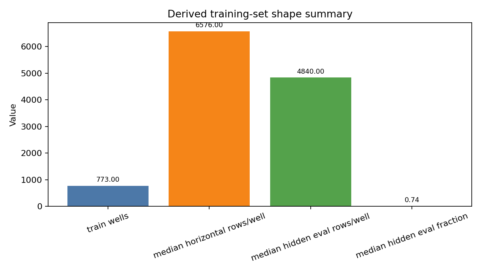
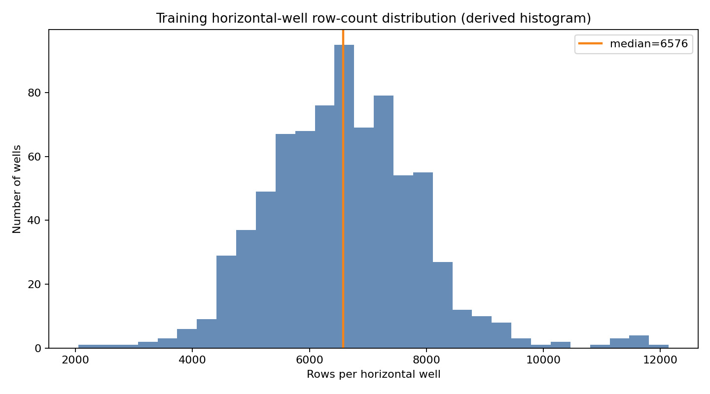
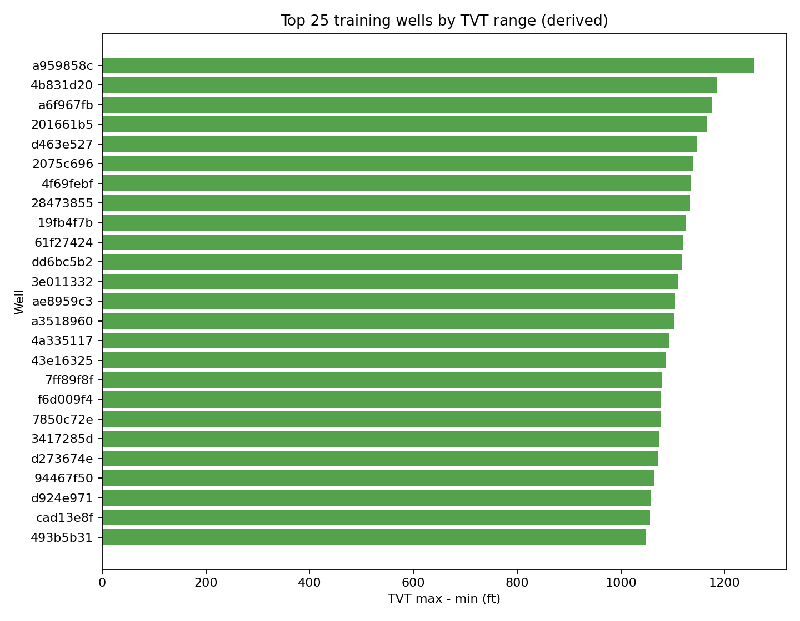
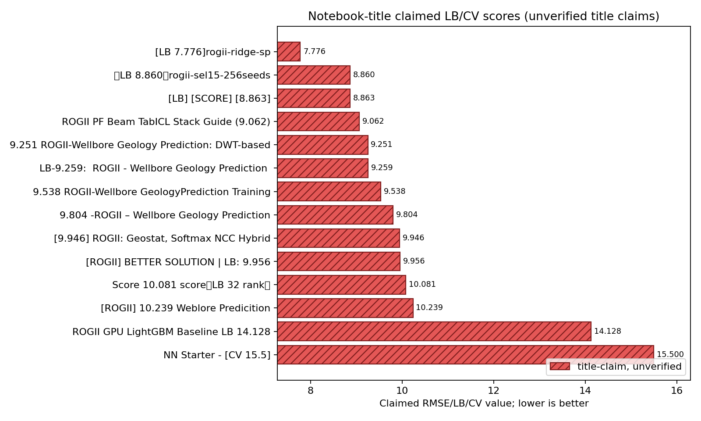
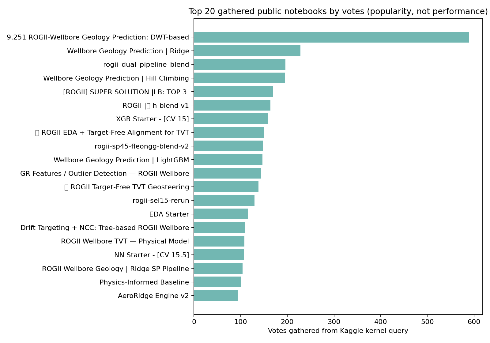

# ROGII Wellbore Geology Prediction — Strategy Brief

**Competition:** [ROGII - Wellbore Geology Prediction](https://www.kaggle.com/competitions/rogii-wellbore-geology-prediction)  
**Research date:** 2026-06-13  
**Goal:** Predict hidden evaluation-zone `tvt` for each horizontal well row from trajectory, gamma-ray logs, visible `TVT_input`, and a paired vertical typewell reference log.  
**Metric:** RMSE on `tvt`; lower is better.  
**Submission constraints:** Kaggle notebook submission only, CPU/GPU runtime <= 9 hours, internet disabled, final file named `submission.csv`.  

## Executive Takeaway

This is not a conventional row-wise tabular regression problem. The public solutions and discussions point to a geosteering/alignment problem: infer a plausible continuation of geological position (`TVT`) by matching the horizontal well's gamma-ray (`GR`) sequence against the typewell's `GR` sequence indexed by `TVT`, anchored by the visible `TVT_input` segment. The path to a competitive score is: strong well-grouped validation, physics/path baselines, GR-to-typewell alignment candidates, many plausible trajectory generators, then OOF-based blending/stacking and conservative path post-processing.

## Competition Mechanics That Matter

- **Prediction target:** `tvt`, the manually interpreted True Vertical Thickness/geological position for rows where `TVT_input` is missing.
- **Inputs per well:** `{well}__horizontal_well.csv`, `{well}__typewell.csv`, and, in train, a PNG cross-section visualization. The horizontal file includes `MD`, `X`, `Y`, `Z`, `GR`, `TVT_input`, and training-only target/geological surface columns; the typewell has `TVT`, `GR`, and `Geology`.
- **Hidden-test caveat:** the visible `test/` folder only contains a few example wells from training; final notebook rerun replaces these with about 200 hidden test wells.
- **Validation rule:** split by well, not by row. The same well contributes thousands of adjacent rows, so row-wise CV leaks heavily.
- **Timeline:** start May 5, 2026; entry/team merger deadline July 29, 2026; final submission deadline August 5, 2026.

## Dataset Diagnostics

Local train data contains **773 training wells**. Each horizontal well has a visible context segment followed by a hidden/evaluation segment; locally the median well has **6,576 rows**, **1,703 visible rows**, and **4,840 hidden rows**. The median hidden fraction is **0.740**, so most of the lateral must be extrapolated rather than merely interpolated.

The target range varies materially by well, with the largest training wells spanning more than 1,200 ft of `TVT`. This is why a single global `Z -> TVT` relationship is insufficient; structural elevation helps across wells, but within-well continuation and typewell alignment dominate the difficult part.

## Public Score Ladder

Public score verification was not retrievable in this run: `fetch_top_kernel_scores.py` returned no usable score rows before the long Kaggle fetch stalled. The following ladder is therefore based only on notebook-title claims gathered from the Kaggle kernel query, not measured leaderboard scores. Treat it as directional evidence of the public solution landscape, not a verified ranking.

| Rung | Evidence | Interpretation |
|---|---:|---|
| Starter tabular | title claims CV 15.0 in [XGB Starter - CV 15](https://www.kaggle.com/code/cdeotte/xgb-starter-cv-15); title claims CV 15.5 in [NN Starter - CV 15.5](https://www.kaggle.com/code/cdeotte/nn-starter-cv-15-5) | Basic grouped residual modeling gets a working baseline but likely misses alignment structure. |
| Early strong public | title claims LB 9.956 in [ROGII Better Solution](https://www.kaggle.com/code/romantamrazov/rogii-better-solution-lb-9-956); title claims 9.251 in [DWT-based](https://www.kaggle.com/code/nihilisticneuralnet/9-251-rogii-wellbore-geology-prediction-dwt-based); title claims LB 9.259 in [LB-9.259](https://www.kaggle.com/code/tasmim/lb-9-259-rogii-wellbore-geology-prediction) | Alignment/path methods move well beyond simple row-wise learners. |
| Stronger public claims | title claims LB 8.860 in [SEL15 256 seeds](https://www.kaggle.com/code/needless090/lb-8-860-rogii-sel15-256seeds); title claims score 8.863 in [LB score 8.863](https://www.kaggle.com/code/safar1/lb-score-8-863) | Multi-seed/selective path ensembles and public-kernel blending are in the high-performing public zone. |
| Aggressive public claim | title claims LB 7.776 in [rogii-ridge-sp](https://www.kaggle.com/code/lightningv08/lb-7-776-rogii-ridge-sp) | Very strong title claim; verify before treating as reproducible or robust. |
| Top-public/leaderboard-style | [SUPER SOLUTION LB: TOP 3](https://www.kaggle.com/code/romantamrazov/rogii-super-solution-lb-top-3) | Title asserts top-3 public position but not a numeric score. Study lineage and overfit risk carefully. |

Popularity is not performance, but it is useful for finding community reference implementations. The top gathered notebooks by votes were:

## Key Public Notebooks to Study

1. [XGB Starter - CV 15](https://www.kaggle.com/code/cdeotte/xgb-starter-cv-15) — clear well-grouped residual baseline. It uses the final visible `TVT_input` as an anchor, builds per-well context features, adds typewell GR correlation features, and validates with `GroupKFold` by well.
2. [EDA Starter](https://www.kaggle.com/code/cdeotte/eda-starter) — fast orientation for wells, target visibility, and file structure.
3. [ROGII EDA + Target-Free Alignment for TVT](https://www.kaggle.com/code/pilkwang/rogii-eda-target-free-alignment-for-tvt) — important conceptual notebook for matching horizontal `GR` against typewell `GR` without using hidden targets.
4. [ROGII Target-Free TVT Geosteering](https://www.kaggle.com/code/pilkwang/rogii-target-free-tvt-geosteering) — follow-up focused on geosteering-style path inference.
5. [9.251 ROGII-Wellbore Geology Prediction: DWT-based](https://www.kaggle.com/code/nihilisticneuralnet/9-251-rogii-wellbore-geology-prediction-dwt-based) — implements constrained DTW/DWT-style alignment, stochastic path realizations, beam search, particle filters, Ridge/CatBoost components, and grouped CV.
6. [Wellbore Geology Prediction | Ridge](https://www.kaggle.com/code/ravaghi/wellbore-geology-prediction-ridge) — influential Ridge/artifact pipeline; many later notebooks cite or build on this family.
7. [Wellbore Geology Prediction | Hill Climbing](https://www.kaggle.com/code/ravaghi/wellbore-geology-prediction-hill-climbing) — blending/weight optimization reference; useful once you have multiple OOF candidate paths.
8. [ROGII Wellbore Geology | Ridge SP Pipeline](https://www.kaggle.com/code/yuriygreben/rogii-wellbore-geology-ridge-sp-pipeline) — strong engineering reference: particle-filter likelihood ensembles, beam configs, selector variants by well properties, Ridge/LightGBM/CatBoost-style stacking.
9. [ROGII: Inference Stack with PF, Beam and TabICL](https://www.kaggle.com/code/kojimar/rogii-inference-stack-with-pf-beam-and-tabicl) — advanced inference-stack example combining particle filters, beam search, and tabular in-context/model components.
10. [Drift Targeting + NCC: Tree-based ROGII Wellbore](https://www.kaggle.com/code/mitchgansemer/drift-targeting-ncc-tree-based-rogii-wellbore) — practical normalized-cross-correlation and drift-targeting feature family for tree models.
11. [GR Features / Outlier Detection — ROGII Wellbore](https://www.kaggle.com/code/mitchgansemer/gr-features-outlier-detection-rogii-wellbore) — useful GR feature diagnostics and outlier handling.
12. [ROGII Wellbore TVT — Physical Model](https://www.kaggle.com/code/sunnywu27/rogii-wellbore-tvt-physical-model) — good reference for physical/geometric priors rather than pure ML.
13. [Physics-Informed Baseline](https://www.kaggle.com/code/karnakbaevarthur/physics-informed-baseline) — cites the better-solution lineage and implements particle-filter/beam/hill-climbing improvements.
14. [rogii_dual_pipeline_blend](https://www.kaggle.com/code/pixiux/rogii-dual-pipeline-blend), [ROGII | h-blend v1](https://www.kaggle.com/code/nina2025/rogii-h-blend-v1), and [ROGII SEL15 Forced Selector](https://www.kaggle.com/code/yaroslavkholmirzayev/rogii-sel15-forced-selector) — study for public-kernel blending and selector ideas, but be alert to leaderboard overfit.
15. [ROGII PF Beam TabICL Stack Guide (9.062)](https://www.kaggle.com/code/afr1ste/rogii-pf-beam-tabicl-stack-guide-9-062) and [Triple-Signal Beam Search + Dual PF + LightGBM](https://www.kaggle.com/code/shinyanagai123/triple-signal-beam-search-dual-pf-lightgbm) — later public notebooks around the PF/beam/stacking family.

## Key Discussions to Read

- [Diagram of the problem](https://www.kaggle.com/competitions/rogii-wellbore-geology-prediction/discussion/697418) — concise visual framing of horizontal well vs. typewell geometry.
- [Welcome to ROGII - Wellbore Geology Prediction!](https://www.kaggle.com/competitions/rogii-wellbore-geology-prediction/discussion/697416) — official orientation and links.
- [How Geologists Interpret Wells: Some Helpful Tips](https://www.kaggle.com/competitions/rogii-wellbore-geology-prediction/discussion/698825) — organizer/domain guidance; high-value context for what human interpreters do.
- [Besides regression, also DWT/time warping!](https://www.kaggle.com/competitions/rogii-wellbore-geology-prediction/discussion/697431) — early high-signal post explaining the core idea: stretch/fold horizontal `MD-GR` to match typewell `TVT-GR`.
- [Multi-trajectory prediction with deep CNN for welllog inversion](https://www.kaggle.com/competitions/rogii-wellbore-geology-prediction/discussion/699853) — frames the ambiguity as multiple plausible trajectories, not a single deterministic path.
- [Share an UI visualizer](https://www.kaggle.com/competitions/rogii-wellbore-geology-prediction/discussion/700424) — includes a viewer repo and useful TVT analogy; use visualization to debug worst wells.
- [Why naive XGBoost hits a wall here](https://www.kaggle.com/competitions/rogii-wellbore-geology-prediction/discussion/701041) — argues for sequence/spatial alignment methods such as NCC, DTW, beam search, and particle filters.
- [A geophysicist's take: domain priors + Q-3D tortuosity](https://www.kaggle.com/competitions/rogii-wellbore-geology-prediction/discussion/702131) — reports domain findings: global `TVT` vs. `Z` correlation can mislead within wells, Q-3D tortuosity helped in ablation, signed azimuth matters, and well-level AEON features hurt.
- [Surface columns are in TVD (Z), NOT in TVT](https://www.kaggle.com/competitions/rogii-wellbore-geology-prediction/discussion/701034) — important feature-meaning warning for `ANCC`, `ASTNU`, `ASTNL`, `EGFDU`, `EGFDL`, `BUDA`.
- [How much should we trust the LB score?](https://www.kaggle.com/competitions/rogii-wellbore-geology-prediction/discussion/704273), [CV and LB correlations](https://www.kaggle.com/competitions/rogii-wellbore-geology-prediction/discussion/701691), and [Public LB test set fixed?](https://www.kaggle.com/competitions/rogii-wellbore-geology-prediction/discussion/701995) — read before making public-LB-driven blending decisions.
- [Private Test Update and Rescore](https://www.kaggle.com/competitions/rogii-wellbore-geology-prediction/discussion/707695) — check current organizer updates before finalizing because this competition is active.

## What It Takes To Do Well

### 1. Build validation around wells and hidden segments

Use `GroupKFold` or `StratifiedGroupKFold` with the well ID as the group. For each validation well, mimic the test condition: expose the `TVT_input` context and score only the later hidden/evaluation segment. Track global RMSE and per-well RMSE. The starter notebooks show the basic pattern, but the discussions warn that public LB trust is limited, so internal validation should drive most design decisions.

### 2. Anchor every path at the visible interpretation

The final non-null `TVT_input` is the strongest anchor. Good baselines include last-known hold, recent-slope continuation, `MD`/`Z` slope continuation, and formation-surface-offset continuation. The best models should predict residuals or candidate trajectories relative to these anchors rather than absolute `TVT` from scratch.

### 3. Treat typewell GR matching as the core signal

The paired typewell is not just another feature table; it is the vertical reference trace to correlate with the horizontal trace. Implement several alignment families:

- **NCC/window matching:** sliding normalized cross-correlation between horizontal `GR` windows and typewell `GR`, as emphasized in [Drift Targeting + NCC](https://www.kaggle.com/code/mitchgansemer/drift-targeting-ncc-tree-based-rogii-wellbore).
- **DTW/DWT:** constrained time warping with Sakoe-Chiba bands and stochastic path realizations, as in [DWT-based](https://www.kaggle.com/code/nihilisticneuralnet/9-251-rogii-wellbore-geology-prediction-dwt-based) and the [DWT discussion](https://www.kaggle.com/competitions/rogii-wellbore-geology-prediction/discussion/697431).
- **Beam search:** dynamic programming over plausible TVT increments with smoothness/move-cost penalties; used by several PF/beam stack notebooks.
- **Particle filters:** sequential Monte Carlo over TVT path states, weighted by GR likelihood and path smoothness; used in the Ridge/SP/PF lineage.

### 4. Generate many plausible path candidates

Repeated GR motifs mean a single best alignment can be wrong. Generate a library of candidate `TVT` paths by varying smoothing windows, DTW radii, beam widths, move costs, particle-filter seeds, likelihood scales, and anchor assumptions. Store not only the candidate path but also uncertainty/spread, likelihood, distance-to-anchor, local slope, residual to typewell `GR`, and rank among alternatives.

### 5. Add domain features selectively

High-value features from public/domain sources include signed azimuth, `dZ/dMD`, lateral slope, trajectory tortuosity, formation-surface offsets, GR rolling statistics, GR missingness, typewell `Geology`, and local correlation scores. Be careful with global `Z -> TVT` shortcuts: the geophysicist discussion reports that global correlation is dominated by cross-well structure and can vanish within a single lateral. Also remember the warning that surface columns are in TVD/Z, not TVT.

### 6. Stack/blend with OOF discipline

Once candidate paths exist, train residual learners and blenders:

- Ridge/positive Ridge on candidate paths and residual features.
- LightGBM/CatBoost for nonlinear correction terms.
- Hill-climbing or constrained linear blending on OOF predictions only.
- Well-type selectors based on evaluation length, `Z` span, GR quality, trajectory direction, and candidate disagreement.

The public ecosystem is heavily blend-driven. That can help, but copying public blends without robust OOF checks risks overfitting the public LB and failing private.

### 7. Visualize failures like a geologist

For every model iteration, plot worst validation wells with horizontal `GR`, typewell `GR`, visible `TVT_input`, candidate paths, final prediction, and true `TVT`. The UI visualizer discussion and PNG cross-sections are useful because many errors are path-level mistakes: a shifted alignment, a jump to a repeated GR motif, or a trajectory that violates smooth geological continuation.

## Recommended Implementation Roadmap

1. **Reproduce a baseline:** implement the [XGB Starter - CV 15](https://www.kaggle.com/code/cdeotte/xgb-starter-cv-15) style grouped residual baseline and a pure last-known/slope baseline.
2. **Create a validation harness:** per-well splits, hidden-segment masking, global/per-well RMSE, and artifact logging for worst wells.
3. **Implement path candidates:** last-known, local slope, `Z`/`MD` slope, surface-offset candidates, typewell interpolation, NCC, DTW, beam, and particle-filter paths.
4. **Engineer candidate diagnostics:** likelihood/correlation, path slope, smoothness, GR residuals, candidate spread, rank, and flags for poor GR or missing values.
5. **Train residual learners:** Ridge, LightGBM, CatBoost, and optionally a small sequence model only after path candidates are strong.
6. **Blend carefully:** optimize OOF blend weights, test selector families, and avoid public-LB-only weights.
7. **Post-process physically:** smooth implausible jumps, preserve anchor continuity at the first hidden row, and enforce plausible TVT increments only when OOF improves.
8. **Harden notebook submission:** deterministic seeds, no internet, packaged external artifacts only if public/allowed, runtime under 9 hours, exact `submission.csv` format.

## Practical Risks

- **Leaderboard overfit:** many high-vote notebooks are blends of public kernels; useful for ideas but risky as final strategy.
- **Unverified public scores:** this brief labels title-embedded scores as title claims because score enrichment was unavailable in this run.
- **Validation mismatch:** spatial or well-property distribution can make GroupKFold noisy; compare several grouped folds and track worst-well behavior.
- **GR ambiguity:** repeated patterns create plausible but wrong alignments; multi-candidate uncertainty is essential.
- **Feature semantics:** treating TVD surface columns as TVT features directly can inject systematic errors.
- **Runtime:** PF/beam/many-seed inference can be expensive; profile early against the 9-hour notebook limit.

## Source and Plot Provenance

- Competition overview and dataset description were fetched with the `nvidia-kaggle-skill` competition workflows on 2026-06-13.
- Public notebook and discussion lists were gathered with the skill's `kernel_query` and `discussion_query` workflows. The local cache contained 668 competition notebooks and 91 discussions for this competition at research time.
- Plot sidecars and render scripts are in `plots/`; PNGs were rendered from their matching JSON sidecars.
- Raw local dataset summary is in `plots/train_well_summary.csv`.

